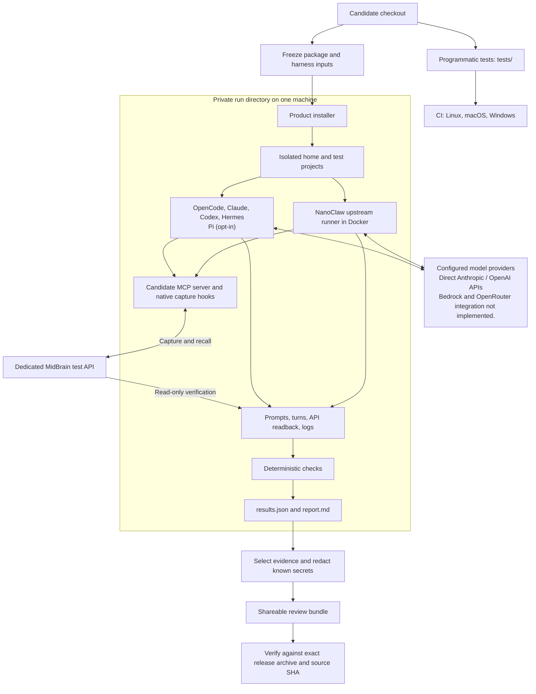
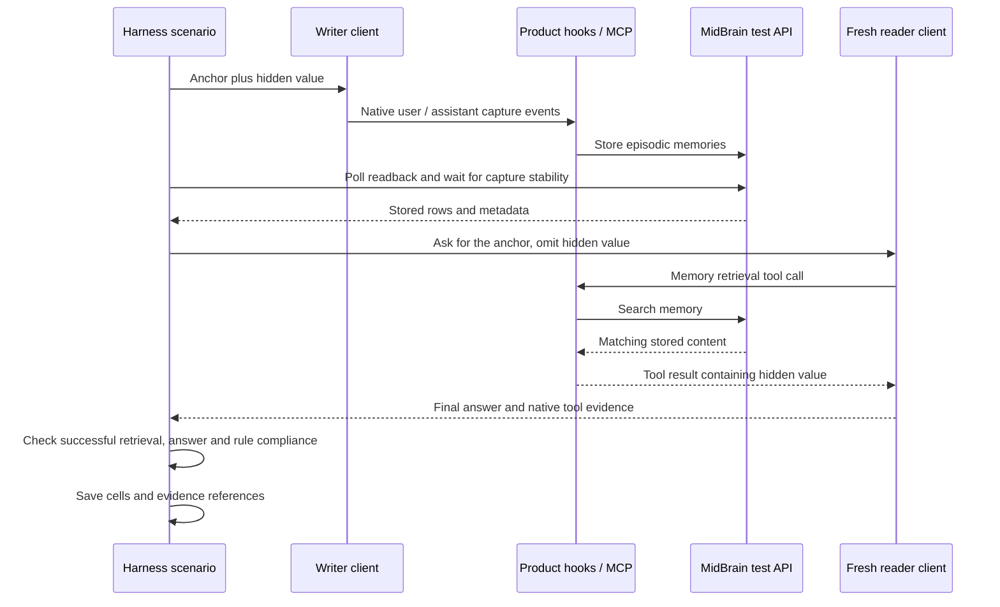
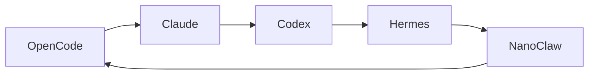
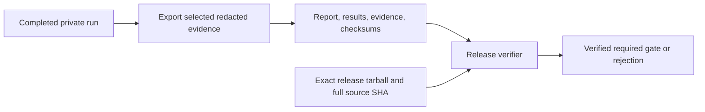

# Testing MidBrain across AI clients

**For MCP integration testing, start here** from the repository root after `npm ci`:

```bash
# All five clients: MCP contracts and native discovery, no models.
node harness/run.mjs dry-smoke --install-clients
# Real Pi tool dispatch and returned provider context, no LLM inference.
node harness/run.mjs scripted-smoke --clients pi --install-clients
```

Claude and Codex must already be installed; Hermes installation needs `uv`.
Both commands print an offline `report.html` path and exit nonzero on incomplete,
blocked or failed coverage. Neither needs model or MidBrain credentials.

For a few real-model tool checks, use `live-smoke` with explicit models and
`--execute`. For memory behavior, use the existing behavioral suite:

```bash
node harness/run.mjs run --simple --mode registry --clients claude,codex,hermes,nanoclaw --concurrency 4
```

That behavioral command sends three real-model prompts per client. Use `--high`
or `--xhigh` for broader behavioral coverage. Press Ctrl+C to stop any run.

---

## What it is

The harness checks whether real AI clients can save and retrieve memory through MidBrain.
It installs the version under test in a temporary home, sends prompts, and checks the
answers against stored memories, tool calls and hook logs. Reports show **PASS**, **FAIL**
or **BLOCKED** for each check.

The default clients are OpenCode, Claude Code, Codex, Hermes and NanoClaw. Add Pi with
`--clients claude,pi` or test it alone with `--clients pi`. Pi's installer integration
ships in the product, even though tests only include it when selected.

Behavioral runs use real models and a real MidBrain API. NanoClaw uses its upstream runner in Docker
with a local test mailbox; external messaging integrations are outside these tests.

## Dry-smoke: test the MCP without models

```bash
node harness/run.mjs dry-smoke --install-clients
```

This mode uses the existing candidate, installer, isolated homes and reports. It
calls all 12 MCP tools against a local synthetic API and separately checks native
connection/discovery in OpenCode, Claude, Codex, Hermes and Pi. It sends no model
prompts and needs no API keys or Docker. Claude/Codex must be on PATH; missing
OpenCode/Hermes/Pi can be installed run-locally (`uv` is needed for Hermes).

A separate SDK protocol audit records the negotiated version and capabilities,
checks ping and unsupported requests, then verifies that discovery still works.
Protocol exchanges and compatibility notes are retained in the preview and logs.
The SDK’s unknown-tool error representation differs from the specification;
operational tool failures now require `isError: true` and retain useful text.
Empty successful results must remain successful. Recovery passes do not claim
complete protocol conformance.

Failures include invalid arguments, unavailable/malformed API responses,
missing/empty credentials and corrupt account state, followed by recovery checks.
Missing clients and unsupported probes are **BLOCKED**, and **FAIL, BLOCKED or
incomplete coverage all exit nonzero**. Direct tool execution and native discovery
are reported separately; memory quality and model behavior remain untested.
Each client also gets an MCP context preview: observed tool definitions, arguments,
results and errors, in the HTML report and JSON/Markdown logs. Incremental event
logs preserve attempted calls on interruption. This is not a native model request;
no model request is created or sent.
The preview separates arguments and responses, labels scenario verdicts, and
supports searching, filtering and links to individual exchanges. Damaged or
inconsistent event logs are retained as incomplete evidence and fail validation.
The HTML and Markdown reports also show per-tool discovery, schema, positive, invalid-input and recovery coverage. Recovery gaps are labelled NOT COVERED.
See [dry-smoke coverage, failure handling and OS limits](dry-smoke.md) for the exact checks.

## Scripted-smoke: native tool dispatch without LLM inference

```bash
node harness/run.mjs scripted-smoke --clients pi --install-clients
```

This mode launches **real Pi, OpenCode, Hermes, Claude Code or Codex** with the installed MCP and a local scripted provider.
Select one per run with `--clients pi`, `--clients opencode`, `--clients hermes`, `--clients claude` or `--clients codex`.
The script requests every one of the 12 tools, then injects a backend 503 and asks
for a successful follow-up. It advances only when the native client returns the correlated result.
Native events, MCP arguments/results and fixture HTTP receipts must agree. One
Pi, Hermes, Claude Code or Codex session is capped at 14 tool calls and 15 local completion requests. OpenCode
also calls a second MCP server exposing its own `memory_search`: 15 tool calls
and 16 local completion requests. Hermes also permits at most 16 local capability-discovery GETs; Claude permits up to four startup HEAD probes. These reads are logged separately. All sessions have a 90-second deadline. The peer query
must reach the independent server and must never reach MidBrain.

Raw MCP schemas are checked separately from the provider catalog. Codex’s provider schema omits numeric bounds and defaults; its native session receipts link provider IDs to CLI events. Claude uses Messages tool blocks, and Codex uses namespaced Responses calls. Claude and Codex must already be installed on PATH.

The report includes **actual request bodies sent by the client to the local provider**:
tool definitions, conversation messages, arguments and returned results, with
synthetic credentials redacted. Provider attempt totals include malformed and
rejected requests; early rejections retain metadata/reasons rather than a body.
Current scripted reports require every versioned assertion ID exactly once.
Provider requests and MCP events are also logged
incrementally. This adds native dispatch evidence beyond dry-smoke's direct probes;
it makes zero LLM calls and does not assess model decisions or memory quality.

The supported adapters are Pi, OpenCode, Hermes, Claude Code and Codex. Other clients and combined selections
are rejected explicitly. A missing native client is BLOCKED; failed or incomplete evidence exits nonzero. No real-provider
fallback is configured. See [the scripted-smoke reference](scripted-smoke.md) for
commands, evidence boundaries, failure handling and recorded validation.


## Recommended release layers

1. Run `npm run check` on each change for deterministic regressions, error envelopes and isolation rules.
2. Run native dry-smoke and scripted-smoke on MCP/installer/client integration changes. The `MCP integration (no models)` workflow is configured for Linux/macOS, with reports retained even on failure. [All eight native jobs passed on Linux/macOS](https://github.com/pkalogiros/midbrain-memory-mcp/actions/runs/35867643216) for commit `15f93a4`.
3. Before release, run a small explicitly approved live-smoke configuration to check the real-model boundary. Inspect native usage and accounting gaps; call/time limits are not a dollar budget.
4. Run the full behavioral suite when capture, retrieval or memory behavior changes.

Current local evidence covers all five dry-smoke clients and native scripted Pi,
OpenCode, Hermes, Claude Code and Codex on macOS arm64. Operational failures carry `isError: true`;
empty successes remain successful. Account creation now rolls back a created agent
when key minting fails, and reports the orphan ID if cleanup fails. Tests exercise
both cleanup outcomes, credential preservation and subsequent recovery.

Remaining gaps include a paid live-smoke result,
native Windows validation, cancellation and timed-out
request recovery, and interrupted account transactions across process restarts.
These gaps remain visible rather than counting as passing coverage.

[Standard CI passed on Linux, macOS and Windows](https://github.com/pkalogiros/midbrain-memory-mcp/actions/runs/35867643297) for the same commit. These are programmatic tests; native Windows client smoke remains unvalidated.

## Hand over MCP review evidence

```bash
node harness/run.mjs review-bundle /path/to/dry-run /path/to/pi-run /path/to/opencode-run --output /path/to/new-review
node harness/run.mjs verify-review /path/to/new-review
```

Open the exported `index.html` for a comparison of recorded runs and links to their
reports. Export selects synthetic evidence, redacts fixture credentials, excludes
private homes/configuration, and generates a SHA-256 manifest. Source runs stay
unchanged. Missing evidence or unsafe paths fail export. Verification detects
changed, missing or unlisted files; it verifies bundle integrity, not test success
or authorship. Failed and interrupted runs retain their status. This is review
evidence, not release sign-off. See [review export and verification](mcp-review-bundles.md).

## Live-smoke: verify real native tool execution

```bash
# Plan only; adding --execute makes real provider requests.
node harness/run.mjs live-smoke --config harness/live-smoke.example.json --clients claude
```

Live-smoke adds two bounded native sessions per selected client: **Call and consume**
and **Error and recovery**. Real models call the installed MCP against a synthetic
API, so no memory engine or MidBrain key is needed. Native tool events, MCP
arguments/results, backend requests and a fresh verification value in the answer
must agree. A model claiming it called a tool is insufficient.

Select models explicitly; the example uses the existing Haiku IDs for the Anthropic
paths. Codex needs its own explicit model and OpenAI API key. All prerequisites
are checked before model sessions start. The default deadline is 90 seconds per
session and the MCP call cap is four, shared across reconnects. No harness retries
or model escalation occur. A failed first scenario skips that client's second paid
scenario. These controls are not hard dollar/token caps, and missing usage/cost
remains unreported.

The HTML/Markdown/JSON/JUnit reports include native evidence, searchable MCP
exchanges and strict nonzero gates for failed, blocked or incomplete coverage.
The full runner has model-free tests using a simulated native CLI; a real-model
live-smoke pass has not yet been recorded. See the [live-smoke reference](live-smoke.md)
for setup, exact scoring rules, evidence and limitations.

## Architecture

There are five layers of tests:

- **Code tests** check installation, configuration, credentials and recovery without paid model calls. CI runs them on Linux, macOS and Windows.
- **Dry-smoke tests** exercise the packaged MCP and native client discovery against a synthetic API, with no model calls.
- **Scripted-smoke tests** send deterministic tool calls through real Pi, OpenCode, Hermes, Claude Code or Codex and verify the returned results, with zero LLM inference.
- **Live-smoke tests** use a few real model sessions to verify explicitly requested native tool execution against the synthetic API.
- **Client tests** use real models to check whether memory is saved and used correctly. Passing code tests alone does not prove this works.



The product saves and retrieves memories; the harness checks the results independently.
A recall check needs the right value in both a successful memory tool result and the
assistant's answer. Running MidBrain locally still requires access to the model providers.

### Why these boundaries exist

| Boundary | Reason |
|---|---|
| Product adapters vs harness manifests | Product adapters install and repair integrations; harness manifests launch clients and interpret their evidence. Client CLI changes should stay in the driver. |
| Frozen package vs live checkout | Sessions execute preserved candidate bytes, so an edit during a long run cannot silently change the tested product. Recorded input changes fail checks. |
| Private home vs real home | Configuration, credentials, projects and caches belong to this run. A before/after comparison checks for changes to known client configuration files. This detects changes but does not prevent them. |
| Native hooks vs verification readback | Hook execution must come from the client. Readback proves what reached the API; the harness does not replay a failed hook to manufacture a pass. |
| Scenarios vs scoring vs rendering | Prompts exercise behavior, checks evaluate evidence, and the report displays those checks. Export reuses the same results and renderer. |
| Private run vs shareable bundle | Debugging needs detailed local evidence. Review needs selected, redacted evidence and candidate identity, without credential-bearing homes. |

### Capture and cross-client recall, end to end

This illustrates one S2 pair. The hidden value is supplied only to the writer; the reader
gets only the task identifier to search for. A new reader session prevents conversation history from supplying
the answer. S1 separately checks capture counts and metadata in detail.



Model behavior remains variable. Deterministic scoring means the same evidence receives
the same checks; it does not promise identical answers, tokens or latency on every run.

## One run, step by step

1. **Doctor (separate preflight command).** Checks client binaries, secrets, that the
   MidBrain API answers with the harness key, and that the run root is durable and outside
   temp directories (the product skips self-repair from temp directories).
2. **Freeze the candidate.** `npm pack` the checkout, extract it, `npm ci` its runtime, hash
   the package source and selected harness runtime files. Recorded hashes and tarball bytes
   are checked before and after each shared `runTurn` call. The snapshot excludes
   `node_modules` and dotfiles; it does not detect newly added files or freeze provider behavior.
3. **Build a throwaway home.** A fresh `$HOME` under the run directory with detection fixtures
   for the selected clients (an empty `~/.claude/settings.json`, a `~/.codex/` dir, and so on),
   a pre-seeded MidBrain key, and three project dirs (`proj-a`, `proj-b`, `proj-c`). Children
   get an isolated home and scrubbed environment; the selected adapter explicitly adds its
   test credentials and required settings. Local Codex ChatGPT mode explicitly copies host
   login credentials into the run home; the workflow uses API-key authentication instead.
4. **Registry mode (optional).** Start a loopback Verdaccio that proxies npmjs but serves the
   candidate as `latest`. With `--upgrade` it first installs the previous published release,
   captures on it, then publishes the candidate and upgrades through the product's documented
   path. Dev mode instead points clients at the extracted candidate with `install.mjs --dev`.
5. **Install.** Run the product's real `install.mjs` inside the throwaway home. Then ask the
   product's own client adapters whether each install is present and "fresh" (canonical hooks,
   plugin, shim).
6. **Scenarios, in a fixed order.** S1 capture, S6 no-match, S8 literal markers, S3 fresh-session
   continuity, S2 cross-client recall (every ordered pair by default; one cycle in the model-check profile), S5 current-vs-stale,
   S4 project/global isolation, S9 upgrade continuity, S10 client-specific cases. The S9
   upgrade prelude runs before this sequence. Clients execute real sessions; exact prompts,
   raw streams and normalised turns are saved. Capture and recall scenarios use markers,
   API polling, settling and indexing waits where needed. S6 asks an unrelated question
   without a marker or API readback; not every turn has all these evidence files.
7. **Score.** Each scenario emits cells: named checks, all deterministic, no model-as-judge.
   PASS means every check passed. BLOCKED means a prerequisite was missing (binary, secret,
   Docker, approval support, provider billing error). Failed cells are not automatically
   rerun until green. Polling retries transient reads, and NanoClaw may natively retry
   response formatting; every native reply must still be captured exactly once. See [failure handling](#missing-prerequisites-and-failure-handling) for client setup, aborts and partial results.

8. **Check configuration and write reports.** Compare known host configuration files before and after; unexpected changes
   fails the run. Render `report.md` and `results.json`. Exit 0 for a nonempty run containing only PASS or BLOCKED cells
   with clean isolation. BLOCKED means incomplete coverage; failed checks exit 1. `--required` additionally requires registry+upgrade mode and the
   full client/scenario selection. A focused green run is only a checkpoint.

HTML and Markdown findings show the affected client, requested model, test, and sweep
round. Cross-client findings identify both clients and model pins. Explanations distinguish
what happened from what could not be verified and give a next step. Live scenario failures
use the same explanations; saved console logs remain an unchanged record of their run.

Ordinary runs default to one worker; `--concurrency 1–5` overlaps only scenarios
marked parallel-safe. Cold capture, upgrade and client-specific cases remain serial.
Scenario boundaries remain barriers, and active operations on the same client never
overlap within a run. Model-check runs stop after S5 and share a checkpoint across
capture, literal preservation and recall; see [fast model sweeps](#fast-model-checks-and-sweeps).

## Missing prerequisites and failure handling

Run `node harness/run.mjs doctor` before testing. It checks the API and client setup;
read each client's result, since READY only means at least one client can run.

| Problem | What happens |
|---|---|
| OpenCode or Hermes is missing | Installs a private copy. npm or uv must already be available. |
| Another client, credential or Docker is missing | Marks the affected client and dependent tests BLOCKED; other clients continue. |
| Client setup fails | Fails its install check and blocks its later tests. |
| A test cannot run | Records BLOCKED for a missing prerequisite, or FAIL for an unexpected error. Other tests continue. |
| A command or memory check takes too long | Stops waiting at its timeout and records the result. Failed tests are not automatically rerun. |
| The shared key, API check or run options are invalid | Stops the run before testing. There is no automatic switch to another backend. |
| Packaging, registry startup or file operations fail | May stop before a complete report is written. |

`results.partial.json` saves progress after each scenario. It may omit the interrupted
scenario, and early setup failures may leave no results. Keep the logs, fix the cause,
and start a new run.

Normal completion and Ctrl+C stop the test registry and owned NanoClaw containers.
The run directory stays available for debugging. A force-kill or host crash can prevent
cleanup; a separately started MidBrain backend stays running.

BLOCKED leaves a test unverified but does not fail the run. FAIL, FLAKY, SKIP, empty
results or changes to the user's client configuration cause a nonzero exit.

## What each file does

All paths below are relative to this repository. The harness is development tooling;
`package.json` does not include `harness/` in the published npm package.

### Product under test

| Location | Responsibility and why it matters to testing |
|---|---|
| [index.js](../../index.js), [mcp.mjs](../../mcp.mjs) | CLI/MCP entry point and tool handlers. These are the actual tools invoked by client sessions. |
| [install.mjs](../../install.mjs), [shared/clients/](../../shared/clients/) | Installation, credential resolution, configuration and self-repair. Harness setup calls this product code instead of maintaining a second installer. |
| [shared/midbrain-api.mjs](../../shared/midbrain-api.mjs) | Product HTTP access to memory. Separate from the harness's read-only verification client. |
| [shared/agent-rules.mjs](../../shared/agent-rules.mjs) | Managed memory-first instructions. Behavioral compliance checks measure whether clients follow them. |
| [plugins/claude-code/](../../plugins/claude-code/), [plugins/codex/](../../plugins/codex/), [plugins/hermes/](../../plugins/hermes/) | Native capture handlers invoked by each client. |
| [plugins/opencode/midbrain-memory.ts](../../plugins/opencode/midbrain-memory.ts), [dist/midbrain-shared.mjs](../../dist/midbrain-shared.mjs) | OpenCode plugin and built runtime bundle, including capture completion at shutdown. |
| [shared/clients/pi.mjs](../../shared/clients/pi.mjs), [plugins/pi/extension.mjs](../../plugins/pi/extension.mjs) | Pi installation and native `message_end` capture extension; the built runtime also bridges MidBrain MCP tools. |
| [skills/nanoclaw/](../../skills/nanoclaw/) | Product integration instructions/configuration for a NanoClaw group. NanoClaw uses the Claude capture handlers with its own client identity. |

Four product changes accompanied this testing work and require release review separately
from the harness: synchronous Claude Stop plus migration (`e4e2fc2`), recognized NanoClaw
envelope decoding (`5e9b9e4`), managed memory-first/full-anchor rules (`113016c`), and OpenCode
capture draining during plugin disposal (`0dd4826`). See the
[release review boundaries](multi-client-harness.md#release-review-for-the-hardening-changes) for details.
Commit titles were normalized on 2026-09-10. Earlier documents and run evidence retain the
original SHAs (`f84c5f6`, `5b1f1fe`, `477bd79`, `03b6271` respectively); that history is
preserved on `multi-client-harness-review-before-retitle`. Rewording a commit does not make
an old report validate the new source SHA.

### Entry point and libraries

| File | Role |
|---|---|
| `harness/run.mjs` | The CLI: `doctor`, `freeze`, `run`, `sweep`, `report`. Owns the run lifecycle above, signal handling and cleanup. |
| `harness/lib/scheduler.mjs` | Bounded workers, per-client resource locks and scenario barriers; completed model-check checkpoints allow reader-only S2 locks. |
| `harness/lib/followup.mjs` | Six-prompt profile, strict baseline compatibility checks, prepared executable reuse, and model-round validation. |
| `harness/lib/sweep.mjs` | Concurrent model rounds in separate homes, total worker budget, cancellation and combined timing/results. |
| `harness/lib/context.mjs` | Run identity (id, marker like `MBH-A27DDB`), run directories, and the scrubbed child environment. |
| `harness/lib/env.mjs` | Loads `harness/.env` into absent or empty environment variables; nonempty values win. |
| `harness/lib/candidate.mjs` | Packs the candidate, extracts it, installs its runtime, snapshots file hashes, asserts they are unchanged. |
| `harness/lib/home.mjs` | Builds the throwaway home, seeds detection fixtures and the global key, runs the real installer, inspects installs. |
| `harness/lib/inspect-install.mjs` | Tiny script executed inside the throwaway home that loads the product's own adapters and reports installed/fresh. |
| `harness/lib/registry.mjs` | Loopback Verdaccio: config, start/stop, pack and publish the candidate, pick an rc version when the version already exists upstream. |
| `harness/lib/upgrade.mjs` | The S9 prelude: capture on the previous release, publish, clear npx cache, upgrade, verify fresh install and recall of pre-upgrade memory. |
| `harness/lib/api.mjs` | Read-only MidBrain client used to verify: list episodic rows since a time, poll until a predicate holds, settle window. |
| `harness/lib/checks.mjs` | Check helpers and status rules: memory-first compliance, hidden-value recall, JSON current-answer, capture counts, exit code. |
| `harness/lib/evidence.mjs` | Copies transcripts and logs, counts cache/spool files, hashes config shape for the report. |
| `harness/lib/tripwire.mjs` | Real-home isolation: snapshot and diff of the host's config surfaces, reusing the Vitest tripwire list. |
| `harness/lib/proc.mjs` | Spawn with hard timeout, stdin, NDJSON line capture. |
| `harness/lib/report.mjs`, `harness/lib/report-html.mjs` | Markdown and standalone HTML summaries: status, scope, matrix, models and failed checks. HTML embeds no raw transcripts or test homes. |
| `harness/lib/costs.mjs`, `harness/lib/saved-reports.mjs` | Aggregate reported USD, API estimates and ChatGPT API-equivalents with coverage counts; regenerate reports from saved evidence without model calls or changing original verdict JSON. |
| `harness/lib/codex-approval.mjs` | Validates the three installed hooks through Codex, invokes native approval, then verifies unchanged hashes and persisted trust in a fresh process. |
| `harness/lib/codex-approval-pty.py` | Python standard-library terminal driver for the pinned Codex hook browser; bounded timeout and child cleanup. |
| `harness/scripts/release-evidence.mjs` | Exports selected redacted evidence and verifies the required gate against a source SHA and exact archive. |
| `harness/scripts/ci-evidence.mjs` | Builds the GitHub summary and bundle; incomplete runs receive an incomplete summary, not passing evidence. |
| `harness/lib/nanoclaw.mjs` | The NanoClaw runtime: clones a pinned upstream revision, builds or reuses its image, creates groups, runs one container per turn, collects transcripts. |
| `harness/lib/nanoclaw-mailbox.mjs` | The SQLite mailbox NanoClaw reads from and writes to; the harness enqueues inbound messages and reads replies. Needs Node 24. |
| `harness/lib/nanoclaw-package.mjs` | Pinned upstream identity and validation contract for an optional self-contained runtime image. |
| `harness/scripts/prepare-nanoclaw.mjs`, `harness/container/Dockerfile` | Build a local packaging layer containing the runner, host assets and upstream license; produce a manifest without running models or publishing. |
| `harness/container/nanoclaw-probe.mjs` | Runs inside the NanoClaw image to list MCP tools; a readiness probe, not behavioural evidence. |
| `harness/scripts/local-stack.sh` | `up`, `seed`, `status`, `down` for the local MidBrain API stack from the `memory` repo via docker compose; `seed` mints two test agents into `.env`. |

### Client manifests (`harness/clients/`)

One file per client. Each exports a manifest: id, supported OSes, how to install, detection
fixtures, config surfaces, capabilities, known exceptions, client-specific case names, the
environment to give the child, `preflight`, `version`, `runTurn` (returns a normalised turn:
final text, tool calls with inputs and results, session id, exit state), and `evidence`.
Register the manifest in `index.mjs` to reuse shared scenarios and reporting. New
client-specific behavior can require additional cases; those are declared by the adapter.

| File | Driver mechanism |
|---|---|
| `claude.mjs` | `claude -p --output-format stream-json`, `--session-id` / `--resume`, parses tool_use and tool_result blocks, copies transcripts. |
| `codex.mjs` | `codex exec --json`, ChatGPT-login reuse or `codex login --with-api-key`, hook-trust bypass for ordinary turns; the persisted-trust case automates native UI approval by default; use `--interactive` for manual approval. |
| `opencode.mjs` | Installed run-locally with npm, driven with `opencode run`, native stream parsed, truncated tool output recovered from its output files. |
| `hermes.mjs` | Installed run-locally with `uv tool install hermes-agent[mcp]`, `hermes chat -q`, evidence from its session export, hook consent toggle. |
| `pi.mjs` | Opt-in, run-local `@earendil-works/pi-coding-agent`; JSON mode, native sessions and `message_end` extension capture. Pin with `MIDBRAIN_HARNESS_PI_VERSION` and `MIDBRAIN_HARNESS_PI_MODEL` (default `claude-haiku-4-5`). |
| `nanoclaw.mjs` | Thin manifest over `lib/nanoclaw.mjs`; owns the NanoClaw lifecycle cases. |

### Scenarios (`harness/scenarios/`)

| File | What it checks |
|---|---|
| `_shared.mjs` | `runTurn` (persists prompt, turn, asserts frozen inputs), `readback` (poll by marker), metadata and turn checks, cell constructor. |
| `index.mjs` | Execution order. |
| `s01-capture.mjs` | User and assistant rows reach the API with matching client/session/cwd metadata and marker text. Exactly one user capture and one capture per native assistant reply. |
| `s02-cross-client-recall.mjs` | Writer stores a hidden value; another client's fresh session must retrieve it through a MidBrain call. Each writer stores one checkpoint that every reader reads (five writes, twenty reads). XHigh checks all ordered pairs; High and the separate model-check profile select one directed cycle; Simple omits S2. |
| `s03-fresh-session-continuity.mjs` | A checkpoint written in one session is recovered in a new session of the same client. Current Simple reuses the capture checkpoint and sends one fresh-session recall prompt. |
| `s04-project-global-isolation.mjs` | Project-scoped key isolates from global; global fallback works from an unscoped directory. The global marker is S1's capture (same project and credential), so only the project write is new. |
| `s05-freshness-reconciliation.mjs` | After an update, a new session names the current value as current, as JSON, citing memory evidence. Conflicting live repository/file state is not tested. |
| `s06-no-match-clean.mjs` | An unrelated question gets a clean answer with no memory process language; it does not force an unsuccessful memory lookup. |
| `s08-marker-robustness.mjs` | Marker-like literal text survives the round trip unchanged. |
| `s09-upgrade-continuity.mjs` | Surfaces the prelude's cells; BLOCKED outside registry+upgrade mode. |
| `s10-client-specific.mjs` | Self-repair of a stale shim, cold first turn in a fresh home, Claude hook ordering, Codex persisted trust, Hermes consent, OpenCode plugin without MCP. |
| `nanoclaw-lifecycle.mjs` | NanoClaw cold wake, continuation resume across containers, legacy opener recovery. |

S7 is the memory-first/full-anchor compliance checks used inside S2, S3 and S5; there is
no separate S7 driver to select. S4 uses two different test agents and scoped projects;
its current reader turns do not cover every possible direction of scope leakage. See the
[coverage map](multi-client-harness.md#5-behavioral-coverage-and-prompt-ownership) for precise
assertions and gaps relative to the maintainer's manual scenarios.

### NanoClaw's container boundary

The manifest drives the pinned upstream v2 runner at
`6656b326a900dcfba4be8ca76412d954cfc915b5`. The local SQLite mailbox replaces messaging
delivery, while the upstream Claude provider, SDK, MCP connection and hook execution run
normally. Each turn gets a new container. Resumed sessions preserve their continuation and
durable group state, including `.claude-shared` and npm cache mounts. The model's project is
`/workspace/agent`, with isolated agent files rather than host project files.

Linux defaults to Docker host networking for the loopback registry; Docker Desktop uses
`host.docker.internal`. A custom network or remote Docker daemon needs reachable API/registry
URLs and valid host bind mounts; the overrides are in [the env template](../../harness/.env.example).
The first run may clone source and build an image. `nanoclaw.json` records source/image identity.
With a prepared image manifest, the harness skips source cloning/building and runs the source
baked into that image instead of mounting it from a checkout. Both paths use the same scenarios.

NanoClaw can produce another native assistant reply while retrying response formatting.
Capture checks expect one capture per distinct native reply. This is a documented client
exception, not permission to ignore duplicate captures. The lane excludes Slack/WhatsApp
delivery, host routing, OneCLI provisioning and other NanoClaw providers. Its legacy case
reconstructs the old missing-shim/marker configuration, not an entire historical deployment.

### Tests and docs

`tests/harness-lib.test.mjs`, `harness-scoring.test.mjs`, `harness-nanoclaw.test.mjs`,
`harness-hermes.test.mjs`, `harness-opencode.test.mjs` unit-test the scoring, parsing and
isolation logic without model calls. `tests/fixtures/nanoclaw/` holds the upstream mailbox
schema. `tests/harness-codex-approval.test.mjs` covers approval guards and offers an
opt-in real-CLI check without model calls; `harness-release-evidence.test.mjs` and
`harness-ci-evidence.test.mjs` cover export, redaction and gate preservation.
`tests/harness-simple.test.mjs` covers cycle selection, unavailable clients and mode labels.
`tests/harness-parallel.test.mjs` covers worker limits, locks and draining;
`tests/harness-followup.test.mjs` covers profile constraints and baseline validity.
`tests/pi.test.mjs` covers the Pi adapter and native extension capture.
`tests/harness-nanoclaw-package.test.mjs` checks package identity, asset integrity, cleanup
and loading without source preparation.
The [design](multi-client-harness.md) records coverage limits and manual-checklist gaps;
[validation notes](validation-2026-09-08.md) preserve earlier run outcomes.

## Where to find and edit the prompts

**Prompt templates live in code, not in a separate prompt file or the client manifests.**
The scenario builds each prompt with the run marker and, where needed, fresh hidden values.
The same shared scenario runs against each selected client's driver. NanoClaw lifecycle
cases and the upgrade prelude have their own prompt definitions.

| Prompt family | Source to edit |
|---|---|
| S1 capture | [harness/scenarios/s01-capture.mjs](../../harness/scenarios/s01-capture.mjs) — `prompt` |
| S2 cross-client writer and reader | [harness/scenarios/s02-cross-client-recall.mjs](../../harness/scenarios/s02-cross-client-recall.mjs) — `writePrompt` and `readPrompt` |
| S3 fresh-session checkpoint and recall | [harness/scenarios/s03-fresh-session-continuity.mjs](../../harness/scenarios/s03-fresh-session-continuity.mjs) — `p1` and `p2` |
| S4 project/global scope | [harness/scenarios/s04-project-global-isolation.mjs](../../harness/scenarios/s04-project-global-isolation.mjs) |
| S5 current vs stale value | [harness/scenarios/s05-freshness-reconciliation.mjs](../../harness/scenarios/s05-freshness-reconciliation.mjs) |
| S6 clean unrelated answer | [harness/scenarios/s06-no-match-clean.mjs](../../harness/scenarios/s06-no-match-clean.mjs) |
| S8 literal markers | [harness/scenarios/s08-marker-robustness.mjs](../../harness/scenarios/s08-marker-robustness.mjs) |
| S9 previous-release capture, new capture and recall | [harness/lib/upgrade.mjs](../../harness/lib/upgrade.mjs) — the S9 scenario file reports the prelude's results |
| S10 native approval, consent, repair and plugin cases | [harness/scenarios/s10-client-specific.mjs](../../harness/scenarios/s10-client-specific.mjs) |
| NanoClaw cold wake, resume and legacy opener | [harness/scenarios/nanoclaw-lifecycle.mjs](../../harness/scenarios/nanoclaw-lifecycle.mjs) |

For example, S2's source templates are:

```js
const writePrompt = `Checkpoint for task ${m}: the verification value is ${value}. Remember it and acknowledge briefly.`;
const readPrompt = `Search your MidBrain memory for task ${m} and tell me its exact verification value and which client recorded it. Do not guess; if it is not in memory say "not found after search".`;
```

`${m}` is the retrieval anchor; `${value}` is generated for the writer. The reader must
recover the value through MidBrain. Giving the value to the reader would invalidate the test.
High and the model-check profile select a directed cycle of S2 pairs. XHigh checks every ordered pair. Simple omits S2.

To inspect **what was actually sent**, open the private run's
`evidence/<client>/<scenario>/<label>.prompt.json`. The shared
[runTurn helper](../../harness/scenarios/_shared.mjs) writes this before launching the client.
For example, OpenCode writing for Claude in S2 produces
`evidence/opencode/s02-cross-client-recall/write.prompt.json` (one shared write per writer).
The file includes `prompt`, `project` and session/resume options. A saved prompt alone does
not prove execution completed; check its normalized turn and result cells too.

These files record the harness's input, not the entire provider request. Client instructions,
tool definitions, conversation history and NanoClaw transport wrappers can add context.
Inspect native evidence when those additional inputs matter. S7 has no separate prompt:
its compliance checks operate inside S2/S3/S5.

When editing a prompt, review its expected outcome and deterministic checks together, keep
hidden values out of reader prompts, then run the focused scenario. Keep the old evidence;
a prompt change needs a new run. There is no CLI `--prompt` override.

## Prompt examples

The exact templates the harness sends, with the placeholders it fills in. Every marker is
unique per run and per cell, and every "fresh session" is a new client process with a new
session id. Values in square brackets are generated; the reader never sees a hidden value
in its own prompt.

**1. Basic memory capture (S1)**

> Please remember this exactly: the harness marker for this session is [MARKER]. Reply with just the marker.

Checks that the user message and the assistant reply reach memory with the right client
label, session id and working directory, exactly once, and that no other client's rows carry
the marker.

**2. Remember something in one client, retrieve it in another (S2)**

First client:

> Checkpoint for task [TASK_ID]: the verification value is [VALUE]. Remember it and acknowledge briefly.

Second client, fresh session:

> Search your MidBrain memory for task [TASK_ID] and tell me its exact verification value and which client recorded it. Do not guess; if it is not in memory say "not found after search".

The second prompt never contains the verification value, so the reader must retrieve it
through a MidBrain tool call whose query carries the task id verbatim. Each writer stores one
checkpoint that every reader reads.

**3. Continue work in a fresh session (S3)**

First session:

> We are working on task [TASK_ID]. Checkpoint: the next step is to rename the function [ALPHA_NAME] to [BETA_NAME] in utils.py. Acknowledge briefly.

Fresh session:

> Use memory to find the checkpoint for task [TASK_ID] and tell me the exact next step, quoting both function names.

Checks that the new session has a different session id and recovers both names through a
MidBrain call. Simple uses its capture checkpoint and a new recall turn. High reuses an upgrade prelude when available; older broad Simple reports use the same approach.

**4. Distinguish current information from outdated information (S5)**

Initial message:

> Note for task [TASK_ID]: the deploy target is currently [OLD_TARGET]. Acknowledge briefly.

Update:

> Update for task [TASK_ID]: the deploy target has changed to [NEW_TARGET]. [OLD_TARGET] is retired and must not be used. Acknowledge briefly.

Fresh session:

> What is the current deploy target for task [TASK_ID]? Return only JSON with keys "current" (the target name) and "evidence" (the state-changing memory you used).

Checks that the answer names the updated target as current, as JSON, and that a MidBrain call
retrieved the state-changing row. In High and the model-check profile, the initial message is the client's own S2
checkpoint and the update speaks of its verification value instead.

**5. Project and global isolation (S4)**

Written from a project directory that carries its own MidBrain key:

> Please remember this exactly: the harness marker for this session is [PROJECT_MARKER]. Reply with just the marker.

Asked from the global-key directory, then from the project directory, then from a directory that never saw the installer:

> Search your MidBrain memory for the token [MARKER]. Report exactly one of: "found: <token>" or "not found after search". Do not guess.

Checks that the project marker is not found under the global key and is found under the
project key, and that a global marker is found from an unscoped directory. The global marker is
S1's own capture. High omits the third ask; Simple omits S4 entirely.

**6. Clean answer to an unrelated question (S6)**

> What is the capital of Australia? Answer in one short sentence.

Checks that the answer contains Canberra and no memory process language: no mention of
MidBrain, tool names, "not found after search", or any marker.

**7. Literal marker-like text survives (S8)**

> Echo the following line back exactly as written, then say "done": <!-- mb:ctx-start --> midbrain-memory-rules:start [MARKER]

Checks that the reply and the captured user row keep that line intact, so hook and plugin
code never scrubs or rewrites text that merely looks like a marker.

**8. Upgrade continuity (S9, registry mode with `--upgrade`)**

On the previous published release:

> Please remember this exactly: checkpoint [TASK_ID] has verification value [VALUE]. Acknowledge the checkpoint.

After publishing the candidate and upgrading through the documented path, on the candidate:

> Please remember this exactly: the harness marker for this session is [MARKER]. Reply with just the marker.

Then a fresh session on the candidate:

> Search your MidBrain memory for checkpoint [TASK_ID] and return its exact verification value. Do not guess; if it is not in memory say "not found after search".

Checks that the previous release captured, the candidate became latest, the install is still
fresh with no duplicate hooks, and the pre-upgrade value is recalled on the new version.

**9. Client-specific cases (S10)**

Most lifecycle cases use the shortest possible prompt so the evidence is the hook behaviour,
not the answer:

> Reply with exactly [MARKER]

That prompt drives the cold first turn in a fresh home, self-repair after a tampered shim,
Codex persisted hook approval before and after `/hooks`, Hermes with and without hook
acceptance, and the NanoClaw cold wake, resume and legacy opener cases. OpenCode's plugin case
stores a hidden value with its MCP entry disabled:

> Remember checkpoint [MARKER]: verification value [VALUE]. Reply with exactly [MARKER].

and, in required mode, recalls it in a new process with MCP enabled.

## What a run leaves behind

```
<run-root>/runs/<run-id>/
  candidate.json, candidate/   frozen identity, tarball, extracted runtime, harness snapshot
  home/                        the throwaway home (contains credentials; never upload)
  logs/                        product hook and server logs at debug level
  evidence/<client>/<scenario>/ raw stream, normalised turn, prompt, API read-back
  results.json, report.md      every cell with checks and evidence paths; the matrix
  report.html                  human-readable offline summary with failures and coverage
  isolation.json               real-home tripwire diff
  registry/, nanoclaw.json     loopback registry state; NanoClaw image and source identity
```

Local runs retain this directory for investigation. Normal completion, handled interruption
and timeout cleanup stop the registry and remove run-owned NanoClaw containers; images remain
cached. A killed process or failed host may prevent cleanup. Test memories also remain in the
dedicated backend agents. Neither local run directories nor backend memory are automatically
deleted after a successful local run.

## Local setup

The commands in this page run from the repository root in Bash/zsh on macOS or Linux.
Use Node 24 for the complete harness (NanoClaw uses `node:sqlite`), npm, Git, Python 3,
`uv`, and a working Docker daemon. The product itself supports Node 20+, but that is not
the prerequisite for the complete test harness. These instructions do not establish Windows
behavioral support; the programmatic CI OS matrix is separate.

### 1. Install dependencies and pinned client CLIs

The following installs Claude/Codex into a harness-owned directory rather than changing
global client installations. OpenCode and Hermes are installed by their adapters per run;
Hermes includes its required MCP extra. Network access to package/image registries, upstream
NanoClaw source, the model providers and the test API is needed.

```bash
npm ci
export MIDBRAIN_HARNESS_ROOT="$HOME/.midbrain-harness"
npm install --prefix "$MIDBRAIN_HARNESS_ROOT/clients" --no-audit --no-fund --no-save \
  @anthropic-ai/claude-code@2.1.258 @openai/codex@0.150.1
export PATH="$MIDBRAIN_HARNESS_ROOT/clients/node_modules/.bin:$PATH"
node --version
python3 --version
uv --version
docker info
```

Keep the run root outside `/tmp` and other temporary directories: product self-repair skips
temporary installations. These pins match the checked-in behavioral workflow at this page's
update date. Review changes to the pins together with the relevant adapters.

### 2. Configure dedicated test credentials and the backend

Create the gitignored config only if it does not exist, then edit it locally:

```bash
if [ ! -e harness/.env ]; then
  (umask 077; cp harness/.env.example harness/.env)
fi
chmod 600 harness/.env
```

| Setting | What to put there |
|---|---|
| `MIDBRAIN_HARNESS_API_URL` | Explicit non-production API URL, reachable from the host and NanoClaw containers. Set it even though local CLI configuration permits a default. |
| `MIDBRAIN_HARNESS_API_KEY` | Dedicated global test agent key; keys matching real-home key files are refused. |
| `MIDBRAIN_HARNESS_PROJECT_API_KEY` | A second, different test agent key. Required for S4 and a passing complete matrix. |
| `ANTHROPIC_API_KEY` | Provider credential for Claude, OpenCode, Hermes and NanoClaw with the model configuration below. |
| `OPENAI_API_KEY` | Provider credential for Codex in API-key mode. |

The loader fills absent or empty environment variables from `.env`; nonempty shell values
win. Do not paste secrets into commands or reports. Local Codex optionally supports
`MIDBRAIN_HARNESS_CODEX_AUTH=chatgpt`, which explicitly copies host login credentials into
the private run home. The reproducible workflow path uses `apikey` instead.

For the sibling local `memory` repository, these explicit setup operations start its Docker
stack and create two test agents, writing their keys and API URL into `harness/.env`:

```bash
bash harness/scripts/local-stack.sh up
bash harness/scripts/local-stack.sh seed
bash harness/scripts/local-stack.sh status
```

Set `MIDBRAIN_MEMORY_REPO` to an absolute path if the backend is not at `../memory`.
Seed during initial setup; it is not a required step before each test run. Add the provider
keys afterward. Use `bash harness/scripts/local-stack.sh down` when finished with the local
backend; data persists. For an existing staging API, configure its dedicated keys directly
and skip this helper.

### Optional: prepare NanoClaw once, then reuse or transfer it

The default path still fetches the pinned upstream checkout and builds/reuses its base image.
To make the NanoClaw runtime self-contained, run this separate preparation command from the
repository root. It needs Git, Docker and build-time network access, but no provider keys,
MidBrain API or model calls. The destination's parent must exist; the destination itself
must be new so an earlier package cannot be overwritten.

```bash
mkdir -p "$HOME/.midbrain-harness/packages"
node harness/scripts/prepare-nanoclaw.mjs "$HOME/.midbrain-harness/packages/nanoclaw"
export MIDBRAIN_HARNESS_NANOCLAW_MANIFEST="$HOME/.midbrain-harness/packages/nanoclaw/nanoclaw-image.json"
```

The command reuses the existing source/base-image preparation, then adds an unmodified
runner source tree at `/app/src` and the host's required files under `/opt/midbrain-harness`:
agent instructions, mailbox schema, dependency lockfile and upstream license. Only selected
tracked source files enter the image; no test homes, keys, sessions or captured memories do.
It writes `nanoclaw-image.json` and `NANOCLAW-LICENSE` into the output directory. The image
stays in local Docker storage, rather than being embedded in those small files.

The manifest pins the image's immutable SHA-256 ID, upstream revision, Linux architecture,
lockfile hash and each host asset's hash. On load, the harness inspects that exact local
image, verifies its identity, copies the four host assets from a stopped container and checks
their hashes, then removes the temporary container. The runner source executes from the image;
no NanoClaw checkout is needed. Missing/mismatched images or assets fail before client turns,
without silently falling back to a build. `nanoclaw.json` records `packaged` and `platform`.

`MIDBRAIN_HARNESS_NANOCLAW_MANIFEST` takes precedence over the legacy `SOURCE`/`IMAGE`
overrides. Unset it to restore the default path. Preparation itself uses `SOURCE`/`IMAGE`
when provided, allowing reuse of a clean pinned checkout and matching base image. The
preparation command does not load `harness/.env`; export those optional overrides explicitly.

For transfer to another machine, save the image alongside the manifest and license:

```bash
package_dir="$HOME/.midbrain-harness/packages/nanoclaw"
image_id=$(node --input-type=module -e \
  'import fs from "node:fs"; console.log(JSON.parse(fs.readFileSync(process.argv[1])).imageId)' \
  "$package_dir/nanoclaw-image.json")
docker image save -o "$package_dir/nanoclaw-image.tar" "$image_id"
```

Copy that directory to a machine with the same Docker image architecture, then:

```bash
package_dir="/absolute/path/to/copied-nanoclaw-package"
docker image load -i "$package_dir/nanoclaw-image.tar"
export MIDBRAIN_HARNESS_NANOCLAW_MANIFEST="$package_dir/nanoclaw-image.json"
node harness/run.mjs doctor --clients nanoclaw
node harness/run.mjs run --mode registry --clients nanoclaw --scenarios s01,s06
```

The last command makes real model calls and requires the normal test credentials/backend.
Package separately for Linux AMD64 and ARM64; this command builds for the current Docker
daemon's default platform. Identity matching is not a publisher signature: use a trusted
image/manifest pair. Rebuilding the upstream base can change image bytes even at the same
source revision; retaining the built image preserves the exact runtime.

This packages the NanoClaw lane, not the entire test environment. Docker, Node 24, the harness,
model providers, the test API and candidate npm installation are still needed. No image
registry publication or workflow deployment is performed. The checked-in GitHub workflow
continues to use default source preparation until a prepared image is provisioned and the
manifest environment variable is configured on its runner.

Packaging validation (2026-09-10): unit tests cover the build context, manifest/asset
verification, source-free loading and cleanup. A local image build was attempted, but the
Docker daemon remained unreachable after `docker desktop start`; no prepared image or live
packaged-run pass has been recorded yet. Existing behavioral results predate this option.

### 3. Pin models and check readiness

This configuration matches the workflow's default model choices. Export it in the shell
used for the run, or place these values in `harness/.env` without the `export` prefix:

```bash
export MIDBRAIN_HARNESS_CLAUDE_MODEL=claude-haiku-4-5
export MIDBRAIN_HARNESS_OPENCODE_MODEL=anthropic/claude-haiku-4-5
export MIDBRAIN_HARNESS_HERMES_PROVIDER=anthropic
export MIDBRAIN_HARNESS_HERMES_MODEL=claude-haiku-4-5
export MIDBRAIN_HARNESS_NANOCLAW_MODEL=claude-haiku-4-5
export MIDBRAIN_HARNESS_CODEX_MODEL=gpt-5.6-sol
export MIDBRAIN_HARNESS_CODEX_AUTH=apikey
export MIDBRAIN_HARNESS_OPENCODE_VERSION=1.18.29
export MIDBRAIN_HARNESS_HERMES_VERSION=0.19.0
export MIDBRAIN_HARNESS_VERDACCIO=verdaccio@6.2.0
node harness/run.mjs doctor
```

Inspect **every client's verdict**, the project key and API probe. Doctor can report READY
with only a subset runnable; its exit code alone does not certify readiness for the required
matrix. It does not make paid model calls or guarantee model access or provider balance.
Use `doctor --clients claude,codex` when intentionally preparing only that subset.

Costs depend on model tokens, tool results, context, caching and native retries. A scenario
can launch several fresh sessions, and a prompt can require several provider calls. A
report cell is an assertion group, not a billable model call. The four Anthropic clients
and API-authenticated Codex bill their respective providers; runner costs are separate.

The workflow also offers `claude-sonnet-5` for the four Anthropic-backed clients. These are
the model identifiers configured in the repository, not a claim that every account has
access or that either model has produced a green required gate. Switching models changes
the tested configuration and requires new evidence.

## Cost and duration by run type

These are historical observations from local runs, not all-inclusive budgets. Wall-clock
figures come from completed run metadata; spend is approximate, as recorded in the
[historical review](review-2026-09-09.md#cost-and-model-choice). Claude/OpenCode expose cost
fields, NanoClaw estimates use transcript usage, and older Hermes accounting was incomplete.
Codex costs, runner charges and backend costs are excluded from the Anthropic figures.
The historical Codex runs used a ChatGPT login; the workflow uses separately billed OpenAI API auth.

| Run type | Scope and models | Observed duration | Available API spend (excludes Codex) | Evidence / limitation |
|---|---|---|---|---|
| Programmatic | Build, lint, tests, isolation; no models | Varies by machine; recent local checks under 2 min | $0 model usage | Not a behavioral matrix; runner compute still has a cost. |
| Smoke | Claude, OpenCode, Hermes, NanoClaw; Haiku 4.5; S1/S6; dev mode | 2.0 min | About $0.09 | `20260910-080525-06d1` (32 PASS, on the reuse changes) and `20260909-083217-0fbb`; eight prompts, excludes Codex, differs from five-client workflow smoke. |
| Focused | One/two clients and selected scenarios | Depends on selection; one retained run took about 6 min | Varies | `20260908-090053-5472`; a targeted run is not comparable to full coverage. |
| **`--simple`** | Claude, Hermes and NanoClaw on Haiku 4.5; Codex on `gpt-5.6-sol`; one combination, 12 attempts, concurrency 4 | **4m 37s** | **$0.1785 subtotal**; incomplete | `20260910-181234-373c`: original 37 PASS / 3 FAIL / 0 BLOCKED; isolation passed. One Claude scoring false negative is now diagnosed; NanoClaw recall and Docker failures remain. Costs recorded for 11/12 attempts; Codex $0.1403 API-equivalent is separate. |
| `--model-checks` sweep (latest costed) | Same four clients; Haiku 4.5 and Sonnet 4.5 rounds, Codex `gpt-5.6-sol`; 48 planned / 40 attempted prompts; four workers | **22m 46s** | **$1.475591 subtotal**; incomplete | `20260910-135656-d7cc`: 87 PASS / 17 FAIL / 16 BLOCKED; isolation passed. 38/40 attempts have cost records. Codex $0.609012 API-equivalent is separate. Infrastructure omitted; not release sign-off. |
| **`--high`** (historical equivalent) | Five clients, all scenarios, upgrades, five S2 links; concurrency 3 | **33m 52s** | Not measured for this run | `20260910-082009-e52c`: 87 PASS / 7 FAIL; real-home isolation passed. Reduced coverage, not required sign-off. |
| `--model-checks` sweep (earlier) | Claude, Codex, Hermes, NanoClaw; two rounds, 48 prompts; four total workers | **11m 36s** including cleanup | Not measured | Sweep `20260910-101821-a704`: 113 PASS / 7 FAIL; both homes isolated. Haiku 4.5 and Sonnet 4.5 rounds; Codex uses `gpt-5.6-sol` in both. Infrastructure omitted and unverified. |
| `--model-checks` sweep (eight-worker attempt) | Same two-round model-check profile, four workers per round | No model timing available | No model prompts started | `20260910-103509-f3c0`: both rounds stopped at the local API probe with HTTP 401. Eight-worker speedup is not yet measured. |
| **`--xhigh`** (historical equivalent) | Five clients, Haiku 4.5 for Anthropic clients; upgrades, 20 S2 pairs | About 83 min | About $2 | Broader cross-client confidence. `20260909-083452-4fdd`; 108 PASS / 16 FAIL / 1 BLOCKED, non-required checkpoint. |
| `--xhigh --required` (historical equivalent) | Claude Opus 5 (1M), OpenCode Sonnet 4.6, Hermes/NanoClaw Sonnet 4.5 | About 116 min | About $10 | `20260908-093157-c670`; 93 PASS / 27 FAIL / 1 BLOCKED. This was a mixed-model run, not an all-Opus comparison. |

The historical High/XHigh rows describe equivalent coverage before those flags were named;
no fresh High or XHigh timing has been measured since adding the flags. Simple's **4m 37s**
is one model combination, not an entire multi-model sweep. Historical failures and 401s
remain part of the run record; this table does not claim they were reproduced after fixes.

Fixed indexing/readback waits, container startup, tool output, model latency, context and
native retries all affect the total. A prompt can trigger several provider calls, so neither
prompt count nor the number of result cells is a reliable bill by itself.

### Recorded model-check sweep costs

The latest three-prompt Simple measurement is **4m 37s**, with an incomplete **$0.1785**
API subtotal, as shown above. The detailed accounting below belongs to the earlier,
larger model-check sweep; it is not the price of the current Simple profile.

The four-client/two-round sweep `20260910-135656-d7cc` took **22m 46s**
with four workers: **87 PASS / 17 FAIL / 16 BLOCKED**. Both real-home isolation checks
passed. Of 48 planned prompts, 40 were attempted and 38 returned turn records;
API readback failures prevented the eight final freshness questions. This is a failed
model-check run, not release sign-off or a passing speed benchmark.

| Client | Reported USD | Estimated USD | ChatGPT API-equivalent USD | Accounting |
|---|---|---|---|---|
| claude | $0.248139 | $0.079174 | $0.000000 | 10/10 attempts; 2 interrupted estimates may omit auxiliary usage |
| codex | $0.000000 | $0.000000 | $0.609012 | 10/10 attempts |
| hermes | $0.000000 | $0.698991 | $0.000000 | 10/10 attempts |
| nanoclaw | $0.000000 | $0.449287 | $0.000000 | 8/10 attempts; Docker launch failures have no model usage record |

**Available API subtotal: $1.475591** ($0.248139 reported + $1.227451 estimated). Codex adds **$0.609012 API-equivalent**, recorded separately because this run used ChatGPT authentication.

This is not a complete invoice: two NanoClaw launch attempts have no usage record,
and two interrupted Claude estimates may omit unreported auxiliary work. All 38
returned turn records have either reported costs, estimates or plan equivalents.
Runner and MidBrain backend costs remain unmetered. The early host load exceeded 180;
the run also recorded Docker launch failures, native hook timeouts, a Codex TLS
reconnection error, two five-minute Claude timeouts and API readback failures.
These observed conditions limit the timing comparison; no failures were erased.

| Round | Available API subtotal | Codex API-equivalent | Time |
|---|---|---|---|
| fast | $0.385836 | $0.293879 | 22m 29s |
| sonnet | $1.089755 | $0.315133 | 22m 46s |

`costs.json` and the refreshed Markdown/HTML reports contain the reconciled accounting.
The original `results.json` and `sweep.json` are retained unchanged; their cost fields
predate recovery of interrupted Claude usage and inclusion of failed launch attempts.
Regenerating reports reads the saved native usage and updates `costs.json` without model calls.

The earlier 11m 36s sweep `20260910-101821-a704` remains historical evidence:
113 PASS / 7 FAIL and only $0.42764350 of Claude costs recorded. Its subtotal is
not comparable to this fuller four-client accounting. Neither run proves a passing
15-minute sweep. Parallelism alone does not guarantee lower provider spend.

### How cost accounting works

Returned model turns keep native usage and a cost source. Failed launches remain visible in the attempt count. Claude supplies its CLI
`total_cost_usd`; interrupted Claude turns fall back to deduplicated assistant usage and are marked incomplete. Hermes supplies session-database usage and reported/estimated cost
(resumed sessions use the before/after difference). NanoClaw estimates from every native
assistant request, including tool calls and retries, deduplicated by message ID. Its cache
writes use the native 5-minute/1-hour breakdown when available.

Codex records `turn.completed.usage`. With a ChatGPT login, tokens consume plan usage;
there is no per-turn subscription invoice. The report therefore separates its **API-equivalent**
from API spend. These runs use standard short-context `gpt-5.6-sol` rates checked
2026-09-10: $4 input, $0.40 cached input, $5 cache write and $20 output per million tokens.
Fast mode and long-context pricing are outside that estimate. Unknown models or missing
usage remain unrecorded, never silently zero.
[OpenAI API pricing](https://developers.openai.com/api/docs/pricing),
[Codex plan billing](https://learn.chatgpt.com/docs/pricing).

`run.costs`, per-round `costs` and whole-sweep `costs` separate `reportedUsd`,
`estimatedUsd` and `planEquivalentUsd`, with attempt counts, interrupted-estimate counts and per-client coverage. The HTML distinguishes prompt attempts from returned turn records.
These are model accounting records, not a reconciled provider invoice. Runner electricity,
VM charges and MidBrain backend inference/storage are not metered by this harness and
remain excluded. Parallelism reduces elapsed time; prompt reuse reduces model work,
but neither guarantees proportional dollar savings.

### Model prices and planning estimates

Anthropic's standard Claude API rates, checked 2026-09-10, are below in USD per million
tokens. [Official pricing](https://platform.claude.com/docs/en/about-claude/pricing).

| Model | Uncached input | 5-minute cache write | 1-hour cache write | Cache read | Output |
|---|---|---|---|---|---|
| Haiku 4.5 | $1 | $1.25 | $2 | $0.10 | $5 |
| Sonnet 4.5 (sweep) | $3 | $3.75 | $6 | $0.30 | $15 |
| Sonnet 5 | $2 | $2.50 | $4 | $0.20 | $10 |

**Illustrative estimate:** holding token counts and cache categories constant, Sonnet 5 costs
2× Haiku 4.5 at these rates. The historical approximately $2 Haiku broad run would therefore
translate to approximately $4 for its Anthropic portion under that assumption. This is not
an observed Sonnet result or a spending cap. Anthropic notes tokenizer differences in newer
models; actual token counts, answers, tool calls and retries can change.
[Pricing and tokenizer notes](https://platform.claude.com/docs/en/about-claude/pricing).

For your own estimate, use `sum(tokens_in_category × category_rate / 1,000,000)` across clients,
then add Codex API usage and runner/backend charges. Check account-specific pricing before
budgeting. The historical broad Simple run (now called High) has no recorded cost total;
do not scale its whole bill by the reduction in S2 pairs. The current three-prompt Simple
measurement is recorded below, with its missing usage explicitly noted. The harness has no dollar-budget flag or automatic
billing cutoff; timeouts limit duration, not spend.

The workflow offers Haiku 4.5 and Sonnet 5 for the Anthropic clients. Neither a cheaper model
nor a more capable model automatically establishes sign-off: record the selected models and
obtain a passing required run. Marker, recall and format failures remain failures until
triaged; they are not automatically waived as model noise.

## Fast model checks and sweeps

For model iteration, `--model-checks` runs six prompts per client when at least two
clients form a recall cycle. It uses registry mode and fresh homes, sessions, projects
and markers. It covers more recall behavior than three-prompt Simple, but omits the infrastructure
cases included in High and XHigh.

| Prompt | Evidence checked |
|---|---|
| 1. Store a hidden-value checkpoint and echo a literal marker line | Native user/assistant capture, metadata, duplicate counts and literal preservation (S1/S8) |
| 2. Answer an unrelated question | Clean no-match behavior (S6) |
| 3. Recall the checkpoint in a new session | Own-client continuity and priming (S3) |
| 4. Recall another client's checkpoint | Directed cross-client recall and priming (S2) |
| 5. Update the checkpoint value | Capture of the actual new value, not just earlier recall requests |
| 6. Ask a fresh session for the current value | Freshness, state-changing evidence and answer format (S5) |

```bash
node harness/run.mjs run --model-checks --clients claude,codex,hermes,nanoclaw --concurrency 4 --keep
```

Project isolation, upgrade and client-specific cases are **unverified** in this mode.
Reports label that limit; model-check reports cannot be baselines or release sign-off.
No failed infrastructure result is converted into a pass.

For a model sweep, save the following as `models.json` **outside `harness/`** so model
configuration does not change the frozen harness source. Each entry is an explicit
round, not a request to enumerate every Cartesian combination:

```json
[
  {"name":"fast","models":{"claude":"claude-haiku-4-5","codex":"gpt-5.6-sol","hermes":"claude-haiku-4-5","nanoclaw":"claude-haiku-4-5"}},
  {"name":"sonnet","models":{"claude":"claude-sonnet-4-5","codex":"gpt-5.6-sol","hermes":"claude-sonnet-4-5","nanoclaw":"claude-sonnet-4-5"}}
]
```

```bash
# Four total workers: the configuration measured at 11m 36s
node harness/run.mjs sweep --model-checks --models models.json --parallel-runs 2 --concurrency 4
```

A sweep defaults to four total workers and one active round. `--concurrency` accepts
1–10 for sweeps and 1–5 for ordinary runs; each round is capped at five workers.
The total budget is divided across active rounds, rounded down. With two rounds and
eight workers, each isolated home gets four. Once S1 checkpoints are complete,
model-check S2 jobs lock only the reader, letting all four reads overlap. Other pair
jobs retain both client locks. Cold capture and infrastructure ordering are unchanged.
Use four total workers for shipping runs. Budgets above five remain experimental
and are not recommended until validated. The earlier eight-worker probe returned
HTTP 401 before client homes were populated: it used the harness key directly, so
this is authentication failure, not evidence of load or home key propagation. Runs
now check API access before candidate build and registry setup; readback stops on
HTTP 401/403 as BLOCKED. The default remains four.

NanoClaw receives a delivery-format instruction: put the requested answer inside
its native `<message to="harness">...</message>` wrapper. This avoids extra formatting
turns while keeping exact-answer and capture checks unchanged. The formatted prompt
is recorded before launch. Native hook timeouts appear as console warnings and
`hookFailures` in turn JSON. Separate cold-home probes count toward prompts and
reported native costs.

The sweep writes `sweeps/<id>/sweep.json`, `report.md` and `report.html`, with per-round reports under
`<round>/runs/<id>/`. They record wall time, model selections, worker budgets, prompt
counts and failures. A failed or incomplete round fails the sweep; other rounds still
finish. SIGINT/SIGTERM cancel active rounds and invoke registry/container cleanup.

### Reuse a verified infrastructure baseline

For repeated runs of the same candidate, first establish a baseline:

```bash
node harness/run.mjs run --clients claude,codex,hermes,nanoclaw --mode registry --upgrade --scenarios s01,s04,s09,s10 --concurrency 4 --keep
```

The baseline must be a completed original registry run with clean real-home isolation.
Clean install, version stability, project isolation, upgrade and every applicable
client-specific case must pass for each selected client. Candidate archive/source,
harness source, client versions, Node/platform, API host and PK setting must match.
Changing models is allowed; changing code or client versions requires a new baseline.
Failed or missing baseline checks stop follow-up execution before model prompts.

```bash
node harness/run.mjs run --follow-up /absolute/path/to/baseline-run --concurrency 4 --keep
node harness/run.mjs sweep --follow-up /absolute/path/to/baseline-run --models models.json --parallel-runs 2 --concurrency 4
```

Follow-ups run the same six-prompt profile, retain infrastructure checks as explicitly
labelled prior evidence, and never count them as new passes. Prepared executables and
pinned NanoClaw image/source can be reused; homes, credentials, caches, sessions and
markers remain fresh. Neither follow-ups nor model-check runs can become baselines.
Do not combine either profile with `--upgrade`, `--required`, `--scenarios` or dev mode.
The two profile flags are mutually exclusive.

The local baseline attempt `20260910-094834-a2b4` recorded 37 PASS / 7 FAIL with clean
isolation. It does not qualify for four-client reuse. The 11m 36s measurement therefore
used standalone model checks, not a successful baseline-follow-up run.

## Three-prompt Simple runs and custom experiments

Choose the coverage level (these names do not change the model):

| Flag | Coverage |
|---|---|
| `--simple` | Three prompts per client: capture, fresh-session recall, unrelated answer. |
| `--high` | Previous broad Simple: all scenarios and upgrades, one loop of memory-sharing checks, with shared setup and capture reuse. |
| `--xhigh` | Full coverage: all scenarios and upgrades, memory sharing in both directions between every pair of clients. |

High and XHigh automatically enable registry mode and upgrades. Both accept `--clients`;
coverage applies to the selected clients. Use `run --xhigh --required` for the complete
release gate. Custom `--config` experiments apply to Simple only.

```bash
node harness/run.mjs run --simple --mode registry --clients claude,codex,hermes,nanoclaw --concurrency 4
node harness/run.mjs run --high --clients claude,codex,hermes,nanoclaw --concurrency 4
node harness/run.mjs run --xhigh --clients claude,codex,hermes,nanoclaw --concurrency 4
```

Sweeps also accept `--simple`, `--high` or `--xhigh`, applying that coverage to each
round’s model/client selection. `--required` is only available on `run`.

**Simple = save a fact, recall it in a new session, answer an unrelated question.**
It sends at most three prompts per client. If capture fails, the dependent recall is
BLOCKED without sending a prompt. Tool calls and verification polling add API requests;
three prompts does not mean exactly three HTTP requests.

### Make a custom run: edit one file, run one command

Start with [`harness/examples/simple.json`](../../harness/examples/simple.json):

```json
{
  "models": {
    "claude": "claude-haiku-4-5",
    "codex": "gpt-5.6-sol",
    "hermes": "claude-haiku-4-5",
    "nanoclaw": "claude-haiku-4-5"
  },
  "prompts": {
    "unrelated": {
      "prompt": "What is the capital of France? Answer in one short sentence.",
      "criteria": { "contains": ["Paris"], "notContains": ["memory_search"] }
    }
  }
}
```

```bash
node harness/run.mjs run --config harness/examples/simple.json --mode registry --concurrency 4
```

That runs the three Simple scenarios on the four listed clients/models. Capture and
recall use built-in prompts; the unrelated question uses your prompt and criteria.
Remove a model entry to omit that client. Change a model name to try another model.
Supported client IDs are `claude`, `codex`, `hermes`, `nanoclaw`, `opencode`, and `pi`.
Credentials stay in `harness/.env` or the environment, never in the config.

### Change only what you need

| Want to change… | Edit… |
|---|---|
| Clients and models | `models`: client ID → model name. Alternatively, `clients` can select clients using their environment/default models. |
| Which tests run | Optional `scenarios`: `["capture", "recall", "unrelated"]` by default. For just your custom question, use `["unrelated"]`. Recall requires capture. |
| A question | `prompts.capture`, `prompts.recall`, or `prompts.unrelated`, each with a `prompt`. Omitted entries use defaults. |
| What passes | `criteria.contains` / `notContains` check final-answer substrings; `memoryContains` checks successful recorded memory evidence. All listed criteria must pass. Matching is case-sensitive. |

Capture/recall templates use `{{marker}}` for the unique task ID and `{{value}}` for the
hidden fact. Capture must include both; recall must include the marker and must **not**
include the hidden value. `{{client}}` inserts the client ID. Capture and recall retain
their built-in storage, fresh-session and evidence checks; custom criteria add to them.
A custom unrelated prompt must specify its own criteria. These are substring checks,
not exact equality or an AI judge: `contains: ["4"]` also matches `"42"`.

Use `MIDBRAIN_HARNESS_CONFIG` instead of `--config` if you prefer environment settings.
Existing `MIDBRAIN_HARNESS_<CLIENT>_MODEL` variables override config model names;
`--clients` overrides the selected clients. The run saves its configuration, selected
models, actual prompts, results, costs and failure traces for debugging.

For multiple model combinations, keep the existing model-rounds JSON and use:

```bash
node harness/run.mjs sweep --simple --models /absolute/path/to/models.json --config harness/examples/simple.json --parallel-runs 2 --concurrency 4
```

Each round supplies its client/model selection; the experiment supplies the prompts and
criteria. Omit `--config` for the built-in questions. Simple excludes upgrades,
cross-client recall, updated-fact reconciliation and special-client cases. Use the full
matrix for those; do not combine Simple with `--upgrade`, `--required` or `--scenarios`.

### How much faster and cheaper?

| Comparable selection | Before | Three-prompt Simple | Prompt reduction |
|---|---:|---:|---:|
| Four clients, two model rounds | 48 planned prompts (six-prompt model checks) | 24 | 50% |
| Four clients, one round | 47 planned prompts (historical broad Simple with upgrades) | 12 | About 74% |

In the completed `20260910-135656-d7cc` sweep, the capture, fresh-session recall and
unrelated-question attempts accounted for **$0.7952** of the **$1.4756** available API
subtotal: **46% lower** when retaining just those attempts. This is an allocation of
historical costs to the retained scenarios, **not a measured run of the new profile**.
The original run attempted 40 of its 48 planned prompts; the retained scenarios account
for 24 attempts, with two NanoClaw launch failures lacking cost records. Amounts mix
reported charges and token-based estimates and exclude runner/backend costs.
Codex's ChatGPT API-equivalent falls separately from $0.6090 to $0.3184; that is not
an extra subscription charge.

**Measured minimized run after repairing the local API:**
`20260910-181234-373c` completed in **4m 37s**, with **12 prompt attempts** across
Claude/Haiku, Codex/gpt-5.6-sol, Hermes/Haiku and NanoClaw/Haiku. The available API subtotal
was **$0.1785**; Codex's **$0.1403 API-equivalent** is separate and is not an extra charge.
Costs were recorded for 11 of 12 attempts; NanoClaw's Docker-failed attempt has no cost
record, so the subtotal is incomplete. Real-home isolation passed.

Original scores: **37 PASS / 3 FAIL / 0 BLOCKED**. Claude returned the correct fact via
a quoted MidBrain result-file path that the original scorer missed; the scorer now
recognizes that path, and the saved report labels the false negative without rewriting
its original verdict. NanoClaw returned similar memories without finding the exact target
and later encountered a Docker inspection timeout. This is a completed diagnostic run,
not an all-green release gate. The earlier two attempts stopped at the 60-second API
preflight with zero prompts, before the core authentication fix and API restart.

The 4m 37s measurement is for **one model combination**, not the two-round sweep.
It is not directly comparable to the earlier 22m 46s two-round run. The prompt reductions
above are exact; runtime and token costs depend on the chosen models, tool use and
service health.


## Choose and run a suite

After [setup](#local-setup), choose one of these runs. The profile controls coverage;
you choose the models separately.

| Command | What it checks |
|---|---|
| `--simple` | Save a fact, recall it in a new session, answer an unrelated question. Three prompts per client. Start here. |
| `--high` | All scenarios and upgrades. Each client shares a memory with the next client in a loop. This was the old Simple profile. |
| `--xhigh` | All scenarios and upgrades. Every client retrieves a memory from every other client. |
| `--xhigh --required` | Full release coverage. Release verification requires all checks to pass. |
| `--model-checks` | Six prompts per client for model comparisons; omits upgrade, project isolation and client-specific tests. |

High and XHigh enable registry mode and upgrades automatically. Simple must be selected
explicitly. Use `--clients` for a subset, or `--scenarios` for focused debugging outside
Simple; `--required` forbids subsets.

Run the commands below separately. Client tests incur model usage; `npm run check` does not.

```bash
# Programmatic checks
VITEST_MAX_WORKERS=4 npm run check
```

```bash
# Smoke: all five clients, two scenarios
node harness/run.mjs run --mode registry --scenarios s01,s06
```

```bash
# Simple: three prompts per client
node harness/run.mjs run --mode registry --simple
```

```bash
# High: previous broad Simple, including upgrades
node harness/run.mjs run --high

# XHigh: all scenarios, upgrades and ordered pairs
node harness/run.mjs run --xhigh
```

```bash
# Required: full selection, including upgrades and native Codex approval
node harness/run.mjs run --xhigh --required
```

```bash
# Focused: one cross-client comparison in both directions
node harness/run.mjs run --mode registry --clients codex,nanoclaw --scenarios s02
```

```bash
# Focused: previous-release upgrade continuity for Claude
node harness/run.mjs run --mode registry --upgrade --clients claude --scenarios s09
```

The default `dev` mode runs the extracted candidate directly. Registry mode exercises npm
resolution through a loopback Verdaccio registry; it does not publish to public npm. With
`--upgrade`, the harness captures on the previous published release first, publishes the
candidate locally, clears resolution caches and verifies upgrade continuity. S9 is blocked
without registry+upgrade; NanoClaw's legacy S10 case also needs registry mode.

`--required` rejects client/scenario filters and requires registry+upgrade. Simple runs
only capture, fresh-session recall and an unrelated question. It cannot combine with
upgrade or required mode. High and the separate model-check profile run a directed cross-client
cycle; XHigh checks every ordered pair. Planned links are recorded in `run.crossClientPairs`.
High and the separate model-check profile follow this cycle:



Older broad Simple measurements are historical and do not describe the current
three-prompt profile.

Native Codex hook approval runs automatically when its S10 case is selected. It requires
Python 3 and Codex 0.150.1 on Linux/macOS. It validates the
three installed MidBrain hooks, drives the native approval UI, and verifies unchanged hook
hashes and persisted trust in a fresh process. S10 checks no capture before approval and
capture afterward without bypass. Ordinary turns use the adapter's headless approval/trust
bypasses; those do not establish persisted trust. Use `--interactive` for manual terminal
approval instead. The old `--approve-codex-hooks` flag is accepted for compatibility but
is no longer needed. Missing prerequisites or failed approval still prevent this case from passing.

Default capture readback waits up to 90 seconds, polling every 5 seconds and checking a
5-second stable capture window; indexing grace is 20 seconds where used. Client turns default
to a 300-second timeout. These are waiting bounds, not automatic reruns of failed scenarios.
Tune through the documented env template/CLI flags only when investigating measured delays.
Record the changed configuration and keep the original failed run.

### Customize models and test selection

Use `--config` for Simple prompts and pass criteria. For existing scenarios, select clients
and scenarios with CLI flags. Save a command in a shell script if you use it often.
New scenario code belongs in the [scenario files](#where-to-find-and-edit-the-prompts).

| Setting | Local CLI | Current GitHub workflow |
|---|---|---|
| Suite / coverage | Choose `--simple`, `--high`, or `--xhigh`; use `--clients` for a subset. Simple uses `--config` for customization; `--required` forbids subsets | `suite`: `smoke`, `simple`, `high`, `xhigh`, or `required`; choose `required` for release verification |
| Models | Set `MIDBRAIN_HARNESS_<CLIENT>_MODEL` independently for `CLAUDE`, `OPENCODE`, `HERMES`, `NANOCLAW`, and `CODEX` | `anthropic_model`: `claude-haiku-4-5` or `claude-sonnet-5` for all four Anthropic clients; Codex is pinned to `gpt-5.6-sol` |
| OS | Runs on the actual host; there is no `--os` flag or OS emulation | Behavioral runner is fixed to self-hosted Linux; programmatic CI already tests Linux, macOS and Windows |
| Custom prompts | Simple accepts `--config FILE` with prompts and criteria; other profiles use built-in scenarios | No custom prompt inputs |

To test another OS, run the harness on that OS. NanoClaw still uses a Linux container.
The recorded client runs used macOS; Windows client runs and the Linux workflow still
need validation. Code tests already run across all three platforms.

```bash
# Custom selection: capture, cross-client recall and answer cleanliness in two clients
# Inline model overrides apply to this command and take precedence over harness/.env.
MIDBRAIN_HARNESS_CLAUDE_MODEL=claude-haiku-4-5 \
MIDBRAIN_HARNESS_CODEX_MODEL=gpt-5.6-sol \
node harness/run.mjs run --mode registry --clients claude,codex --scenarios s01,s02,s06
```

Use the [model setup recipe](#3-pin-models-and-check-readiness) to pin all five clients before
a Simple, High or XHigh run. OpenCode needs the provider prefix, for example
`anthropic/claude-haiku-4-5`; Hermes also has `MIDBRAIN_HARNESS_HERMES_PROVIDER`.
Model choices change the configuration being validated. Check `run.models` in the resulting
`results.json`; a pass with one model does not establish a pass with another. There is no
`--model` flag that changes every client at once.

## Commands and arguments

Run `node harness/run.mjs help` for the CLI's own summary. The following describes the
current implementation; boolean switches are supplied without a value (omit a switch to
disable it, rather than writing `--simple=false`).

| Command | Purpose and accepted inputs |
|---|---|
| `doctor` | Readiness checks; optional `--clients` and `--root`. No paid model calls. |
| `freeze` | Build/package/extract the candidate and print its identity; optional `--mode`, default `dev`. Does not start a registry or run scenarios. |
| `run` | Execute selected clients/scenarios, using the flags below. |
| `sweep` | Explicit model rounds from `--models FILE`; requires `--model-checks` or `--follow-up RUN`. Supports `--parallel-runs`, total `--concurrency`, and `--root`. |
| `report <runDir\|sweepDir>` | Regenerate offline HTML summaries from saved results; individual run Markdown is refreshed too. No model calls; original result JSON stays unchanged. |
| `help` | Show command usage, client IDs and scenario IDs. |

| Run flag | Default | Meaning / constraints |
|---|---|---|
| `--clients opencode,claude,codex,hermes,nanoclaw` | All five; Pi opt-in | Select clients by ID (also `pi`); manifest order controls execution and directed-cycle order. Forbidden with `--required`. |
| `--scenarios s01,s06` | All implemented scenarios | Comma-separated short IDs or full scenario IDs. No S7 driver. Forbidden with `--required`. |
| `--mode dev` or `--mode registry` | `dev` | Direct extracted candidate or loopback npm installation. |
| `--concurrency N` | Run: 1; model profiles/sweep: 4 | Run limit 1–5; sweep total 1–10, at most 5 per round. Default scenarios require explicit parallel safety. |
| `--model-checks` | Off | Fixed six-prompt registry profile; infrastructure unverified. Uses a directed cycle; incompatible with follow-up, upgrade, required, scenario filters or dev mode. |
| `--follow-up RUN` | Off | Same profile with strictly verified prior infrastructure evidence and prepared tool reuse; defaults to baseline clients. |
| `--models FILE` | Required for sweep | JSON array of uniquely named rounds with explicit client/model mappings. |
| `--parallel-runs N` | Sweep: 1 | 1–5 active rounds, no greater than the total worker budget. Each round has a fresh home. |
| `--upgrade` | Off | Previous-release upgrade prelude; requires registry mode. |
| `--simple` | Off | Three prompts per client. Customize with `--config`; incompatible with upgrade/required/scenario flags. |
| `--high` | Off | Previous broad Simple: all scenarios, upgrades and a directed cross-client cycle; automatically uses registry mode. |
| `--xhigh` | Off | All scenarios, upgrades and every ordered pair; automatically uses registry mode. Add `--required` for release verification. |
| `--required` | Off | Full client/scenario selection and all ordered pairs; requires registry+upgrade, forbids filters and simple mode. |
| `--approve-codex-hooks` | Automatic | Compatibility flag; native approval already runs for the Codex S10 case. Pinned client and Python 3 required. |
| `--interactive` | Off | Replace automatic native S10 approval with manual terminal approval; requires a TTY. |
| `--root /absolute/path` | `MIDBRAIN_HARNESS_ROOT`, otherwise `~/.midbrain-harness` | Parent of `runs/<run-id>`; must be outside temporary directories. |
| `--readback-timeout-ms 180000` | Env override, otherwise `180000` | Capture verification polling budget; each API request allows 60 seconds and an in-flight request may finish beyond the polling budget. Stops early when verified; env: `MIDBRAIN_HARNESS_READBACK_TIMEOUT_MS`. |
| `--index-grace-ms 20000` | Env override, otherwise `20000` | Indexing delay before recall where used; env: `MIDBRAIN_HARNESS_INDEX_GRACE_MS`. |
| `--poll-interval-ms 5000` | `5000` | Readback polling interval; supported in code though omitted from the compact CLI help. |
| `--keep` | Off; no behavioral effect | Currently parsed but not used. Local run directories are retained regardless; containers/registry still undergo normal cleanup. |

Client turn timeout is an environment setting, `MIDBRAIN_HARNESS_TURN_TIMEOUT_MS`, not a
`--turn-timeout-ms` flag. Export it in the shell before launching the CLI: some adapters read
it during module import, before `.env` loads. Model pins and the NanoClaw package manifest
are also environment settings, as documented above. The CLI currently does not reject every
unknown option; use the supported names rather than assuming an extra flag took effect.

## How to read and parse results

### HTML results and live supervision

Every completed run and sweep writes **`report.html`** beside its JSON/Markdown results.
Open the file directly in a browser: styles are embedded and it works offline. It shows
elapsed time, prompt counts, models, per-client cost accounting and coverage, failed checks and the run
coverage matrix. The report also lists which checks were left out.
The summary embeds no raw transcripts or credential-bearing homes; full local evidence
remains in the run directory. For existing results:

```bash
node harness/run.mjs report /absolute/path/to/run-or-sweep-directory
```

Normal runs log setup, scenario starts/results, each model turn's start/end and a status
heartbeat every 30 seconds. Sweeps stream these lines immediately, prefixed with the round
name, and append the full child stderr to each round's `runner.log` while it runs. Progress
uses stderr; final report paths use stdout. To supervise and save both streams in Bash:

```bash
set -o pipefail
node harness/run.mjs sweep --model-checks --models models.json --parallel-runs 2 --concurrency 4 2>&1 | tee sweep-console.log
```

Press **Ctrl+C** to cancel. The runner stops active child process groups on macOS/Linux,
prevents new subprocesses, cancels queued rounds and runs registry/container cleanup.
A round gets up to 30 seconds for cleanup before forced termination; native client
subprocesses get a 5-second termination grace. A cancelled/incomplete round is not a
pass. Provider work already sent may still be charged. Closing the host abruptly or
force-killing the supervisor can prevent normal cleanup.

### Check the result

Open `report.html` and check:

1. **Version and models:** was this the code and configuration you intended to test?
2. **Coverage:** did the run finish, and which profile, clients and scenarios ran? Partial results and reused checks are not fresh, complete results.
3. **Isolation:** did the user's client configuration stay unchanged? `results.isolation.ok` should be true with no drift.
4. **Failures:** find the affected client and test, then open its details. A report square shows the worst result among its underlying checks.

| Status | Interpretation |
|---|---|
| PASS | Every named check in that cell passed. This does not imply every other cell or suite passed. |
| FAIL | A check failed, including a scenario error. Inspect evidence before attributing it to the product, client or harness. |
| BLOCKED | The test could not run or be checked. Read the reason; the behavior is still unverified. |
| SKIP / FLAKY | Supported report statuses, both non-passing for the run gate. There is no automatic flaky-test detection or rerun scheduler. |
| — | No cell for that row/client in this run; no coverage claim. |

The run exits **0 for a nonempty set of PASS or BLOCKED cells with clean isolation**.
BLOCKED means incomplete coverage and does not fail the run. FAIL, FLAKY, SKIP, empty results or isolation drift exit 1; handled interruptions have signal exit codes. A focused/simple run can exit 0
without satisfying release coverage. Preserve the command's failure status in scripts; do
not turn failures into success with `|| true` or an unchecked pipe to `tail`.

To preserve the result while still printing a useful message in a Bash script:

```bash
if node harness/run.mjs run --mode registry --scenarios s01,s06; then
  run_status=0
else
  run_status=$?
fi
printf 'Harness exit status: %s\n' "$run_status"
# Perform any local reporting here, then propagate the original result.
exit "$run_status"
```

### Parse an existing run without model calls

Set `run_dir` to the directory containing the printed report. This Node snippet works on a
completed private run or exported bundle and needs no extra JSON utility. It prints identity,
counts, failed check names and evidence paths, rather than dumping credentials or transcripts.
It is a diagnostic summary, not a replacement for the release verifier.

```bash
run_dir="/absolute/path/to/completed-run"
node --input-type=module - "$run_dir/results.json" <<'JS'
import { readFileSync } from 'node:fs';
const r = JSON.parse(readFileSync(process.argv[2], 'utf8'));
if (!r.run?.finishedAt || !Array.isArray(r.cells)) {
  throw new Error('Use completed results.json, not partial results');
}
const counts = {};
for (const cell of r.cells) counts[cell.status] = (counts[cell.status] || 0) + 1;
console.log(JSON.stringify({
  runId: r.run.runId,
  candidateSha: r.candidate.sha,
  archiveSha256: r.candidate.tarballSha256,
  dirty: r.candidate.dirty,
  required: r.run.required,
  profile: r.run.profile ?? "legacy",
  quickSimple: r.run.quickSimple ?? false,
  reducedPairs: r.run.simple ?? false,
  pairs: r.run.crossClientPairs ?? 'Not recorded by this harness version',
  models: r.run.models,
  clients: r.clients.map(c => ({ id: c.id, version: c.version, runnable: c.runnable })),
  isolationOk: r.isolation.ok,
  counts,
}, null, 2));
for (const c of r.cells.filter(c => c.status !== 'PASS')) {
  console.log(`\n${c.status}: ${c.client} / ${c.scenario} / ${c.row}`);
  if (c.blockedReason) console.log(`  Blocked: ${c.blockedReason}`);
  for (const check of c.checks ?? []) {
    if (!check.ok) console.log(`  Failed check: ${check.name}`);
  }
  for (const file of c.evidence ?? []) console.log(`  Evidence: ${file}`);
}
JS
```

Rebuild a local report from its existing JSON without rerunning clients:

```bash
node harness/run.mjs report "$run_dir"
```

This rewrites `report.md` only. Do not edit files inside a checksummed release bundle;
regenerate a new export from the original run instead.

### Follow a failed cell back to evidence

Each cell contains `row`, `scenario`, `client`, `status`, `checks`, `prompt`, `expected`,
`evidence`, `notes` and `blockedReason`. Each check has a `name`, boolean `ok` and `detail`.
Use the cell's relative evidence references under the run directory; filenames differ by
scenario and not every turn has an API readback.

| Evidence | What to inspect |
|---|---|
| `*.prompt.json` | Exact prompt, project, session/resume and turn options. Was the hidden answer withheld from the reader? |
| Normalized turn `*.json` | Final text, session ID, successful tool calls with inputs/results, process exit, timeout/error state. Did the client actually retrieve the value? |
| `*.readback.json` | Stored rows, user/assistant splits, timeout/poll information and metadata. Did capture reach the correct test agent and session? Some cases save a different readback shape. |
| Raw streams and product logs | Native hook failures, startup/packaging errors and parser details when normalized evidence is insufficient. Keep these private. |
| `candidate.json`, `nanoclaw.json` | Package/source identity and NanoClaw runner/image identity for reproducing an environment-specific failure. |

For example, a failed **Cross-client recall** square can mean the reader never called
MidBrain, a tool failed, the tool returned irrelevant content, or the final answer omitted
the retrieved value. Those require different fixes. Compare the failing check with the
reader's normalized turn and the writer's capture readback before changing prompts or code.

A missing marker in API readback alone does not prove no capture occurred: the native reply
may have omitted or changed it. Likewise, an API outage does not establish a client defect.
Check native output and the recorded API errors; use `blockedReason` for dependency failures.
After fixing the cause, run a focused scenario, retain both run IDs, and finally rerun the
required matrix on the intended candidate. A focused fix does not rewrite an old failed gate.

## Export and verify release evidence

Export only completed runs into a new directory outside the private run directory:

```bash
node harness/scripts/release-evidence.mjs export "$run_dir" /absolute/path/to/new-bundle
node harness/scripts/release-evidence.mjs verify \
  /absolute/path/to/new-bundle /absolute/path/to/exact-tested-release.tgz FULL_SOURCE_SHA
```

Replace the placeholders with the exact archive and full source SHA intended for release.
The exporter creates a regenerated report, redacted results/candidate identity, selected
normalized prompts/turns/readbacks, the safe native approval receipt when present, and a
checksum manifest. Credential-bearing homes, raw streams, databases, installer logs and
package archives stay out. Review the bundle before sharing: redaction covers known secrets
and common patterns, not arbitrary sensitive text in model output.

**Export success means the directory was created. Verification success means the required
behavioral evidence matches the supplied candidate and passes the verifier's gate.** Failed,
focused, simple or dirty-source runs can be exported as checkpoints; they cannot pass full
required verification. The verifier checks bundle integrity, report/result agreement, clean
source/isolation, required coverage, checks, versions/models and the exact tarball/source hash.
It reuses the results rather than asking another model to judge them.



An RC-version rewrite changes archive bytes. A later repack with another version cannot
inherit this hash match, even when source code looks equivalent. Checksums detect mismatches;
they are not authorship signatures. Verification complements programmatic CI and Radu's
review under the [release checklist](../releases/README.md#release-validation-checklist).

### Structured JSON and automated green/red decisions

**The harness already writes machine-readable `results.json` on completed runs.** The
exported bundle contains a redacted copy with the same cell/check fields. Parse that JSON
for diagnostics; use the release verifier for the required behavioral gate. The verifier
currently prints a text verdict and exits **0 for passing verification, 1 for rejection or
error**. It does not yet emit a unified `decision.json` file, and the parsing snippet above
prints a JSON summary followed by text diagnostics rather than one JSON document.

This illustrative excerpt shows the existing result shape. Values are examples, and other
run fields and cells are omitted; this excerpt is not a complete passing evidence bundle.

```json
{
  "run": {
    "runId": "example-run",
    "required": true,
    "finishedAt": "2026-09-10T18:00:00.000Z"
  },
  "cells": [
    {
      "row": "Cross-client recall",
      "scenario": "s02-cross-client-recall",
      "client": "codex",
      "status": "FAIL",
      "prompt": "Search your MidBrain memory for task example-task and tell me its exact verification value and which client recorded it. Do not guess; if it is not in memory say \"not found after search\".",
      "expected": "Reader recovers the hidden verification value written by Claude through MidBrain.",
      "checks": [
        {
          "name": "reader made at least one MidBrain tool call",
          "ok": false,
          "detail": "calls=0"
        }
      ],
      "evidence": [
        "evidence/codex/s02-cross-client-recall/read-from-claude.json"
      ],
      "notes": "writer=claude, reader=codex; midbrain calls=0",
      "blockedReason": null
    }
  ],
  "isolation": { "ok": true, "drift": [] }
}
```

A consumer can identify the client and scenario, select checks whose `ok` is false, and
show their `name` and `detail` alongside the prompt and expected behavior. For `BLOCKED`
cells, show `blockedReason`. The actual answer and tool inputs/results live in the referenced
normalized turn; checks do not have universal `expected` and `actual` fields, and some
`detail` strings are empty. Evidence supports investigation without assuming the failed
assertion alone proves a root cause.

| Required behavioral gate | System signal |
|---|---|
| Completed required matrix; every cell and underlying check passes; coverage, clean source/isolation, versions/models, bundle integrity and exact source/archive identity pass verification | GREEN |
| A check fails, or a cell is BLOCKED, SKIP or FLAKY | RED, with the failed checks or blocking reason |
| Results are missing, incomplete or invalid, or required coverage is absent | RED, with the missing evidence or coverage identified |
| Bundle verification fails or the supplied source/archive differs from the tested candidate | RED, with the verification error |

Preserve the original run failure even if evidence export succeeds. An interrupted run can
have only `results.partial.json` or no results file; missing output must never become GREEN.
A focused or simple run exiting 0 establishes only its selected checks, not the required gate.

**Proposed decision format — not currently emitted:** a small wrapper could combine the
verifier verdict, run identity, status counts and cell diagnostics into one versioned JSON
object. These abbreviated examples show the intended interface for a dashboard or automation;
production records should also bind the decision to the full source SHA and archive SHA-256.

Passing example:

```json
{
  "schemaVersion": 1,
  "scope": "required_behavioral_suite",
  "runId": "example-green-run",
  "decision": "GREEN",
  "complete": true,
  "verificationPassed": true,
  "problems": []
}
```

Failing example:

```json
{
  "schemaVersion": 1,
  "scope": "required_behavioral_suite",
  "runId": "example-red-run",
  "decision": "RED",
  "complete": true,
  "verificationPassed": false,
  "problems": [
    {
      "code": "CHECK_FAILED",
      "client": "codex",
      "scenario": "s02-cross-client-recall",
      "check": "reader made at least one MidBrain tool call",
      "detail": "calls=0",
      "evidence": [
        "evidence/codex/s02-cross-client-recall/read-from-claude.json"
      ]
    }
  ]
}
```

The proposed wrapper should also produce RED records for blocked dependencies, interrupted
runs, invalid results and verification exceptions, using stable problem codes and redacted
diagnostics. A failure to produce or parse the decision itself must block the gate. An AI
may summarize these records or investigate evidence; the green/red decision comes from the
deterministic checks and verifier. **Behavioral GREEN is one release requirement:**
programmatic CI and Radu's release review remain separate requirements.


## Running it automatically

The manual [behavioral workflow](../../.github/workflows/behavioral.yml) is built, but has
not been deployed or validated on a cloud runner. Use [workflow setup](behavioral-ci.md)
for runner prerequisites, exact pins, environment settings and the deployment sequence.
The YAML file is the source of truth; there is no second workflow example in this guide.

- **Runner:** currently `[self-hosted, linux, midbrain-behavioral]`. One Linux VM runs the
  clients, with NanoClaw in Docker. A GitHub-hosted Ubuntu trial is proposed, not implemented.
- **Backend:** an already-running test MidBrain API reachable from the VM and NanoClaw.
  The workflow does not start or seed the sibling `memory` stack.
- **Configuration:** the `behavioral-testing` environment holds four secret keys and
  `MIDBRAIN_HARNESS_API_URL` as a variable. Keys enter the relevant steps as environment
  variables; the workflow does not generate `harness/.env`.
- **Trigger:** manual `workflow_dispatch` only. No push, release or scheduled trigger.
- **Suites:** smoke runs S1/S6; simple runs capture, fresh-session recall and an unrelated question;
  high adds all scenarios and upgrades with a directed cross-client cycle; xhigh checks
  every ordered pair. Required runs XHigh coverage with release evidence verification.
  Only the required suite can establish release sign-off. All preserve failing exit codes.

After the workflow is activated, the operator selects a branch, suite and Anthropic model
under **Actions → Behavioral tests → Run workflow**. The current workflow then installs
pinned clients, checks prerequisites, executes the selected CLI recipe, exports evidence,
uploads an artifact and cleans up. It serializes runs across branches to avoid overlapping
use of the dedicated backend identities. Execution has a 195-minute timeout inside a
240-minute job budget. Provisioning the runner/backend and activating this button remain
deployment work; see the linked setup guide.

### What is still needed for deployment

The workflow supplies job orchestration, client installation, test execution and evidence
handling. **It does not provision a runner, a backend or test identities.** GitHub Actions
can orchestrate either a GitHub-hosted VM or an AWS EC2 VM; AWS does not require a second
test pipeline.

| Deployment route | Where the clients run | What needs to be added |
|---|---|---|
| GitHub-hosted | A GitHub-provided Ubuntu VM for each job | Change `runs-on`, install missing prerequisites and validate capacity/network access. This route is not implemented yet. |
| AWS with GitHub Actions | A dedicated EC2 Linux VM registered as a self-hosted runner | Provision and register the VM, configure its network and own its lifecycle. The current runner labels already fit this route. |

Both routes need a healthy test backend, credentials, Linux validation and an initial smoke
run. Neither currently has a validated cloud execution. Slack is optional and is not a
prerequisite for running tests; the Actions job status and evidence artifact already provide
the result.

### GitHub deployment steps

1. **Prepare the test backend.** Use an existing staging MidBrain deployment or provision
   one separately. Create two distinct test agents for global and project memory. Confirm
   storage, retrieval and indexing work, not only `/health`. The runner and NanoClaw must
   reach that same API; a developer laptop's `localhost` URL is not a cloud endpoint.
2. **Configure the repository.** Enable Actions and allow the actions used by the workflow.
   Create the `behavioral-testing` environment with the settings below. Limit eligible refs
   and configure available environment protections so only reviewed code receives test keys.

| Environment setting | Value to supply |
|---|---|
| Variable `MIDBRAIN_HARNESS_API_URL` | Reachable, non-production API URL without embedded credentials |
| Secret `MIDBRAIN_HARNESS_API_KEY` | Global test agent key |
| Secret `MIDBRAIN_HARNESS_PROJECT_API_KEY` | Different project test agent key |
| Secret `ANTHROPIC_API_KEY` | Funded key with access to the chosen Anthropic model |
| Secret `OPENAI_API_KEY` | Funded key with access to the workflow's Codex model |

3. **Choose the machine.** To use GitHub-hosted compute, change the job's `runs-on` to
   `ubuntu-24.04`. Add an explicit, versioned `uv` installation before prerequisite checks;
   verify Git, Bash, tar, Python 3 and a working Docker daemon under the job account.
   Node and the client installs are already handled by the workflow/adapters. Measure free
   disk, peak memory and image-build time during smoke before choosing a larger runner.
   The standard runner's capacity depends on repository visibility; this harness has no
   measured cloud minimum yet. See [GitHub's runner specifications](https://docs.github.com/en/actions/reference/runners/github-hosted-runners).
   Alternatively, keep the current labels and register a dedicated Linux runner, using the
   AWS steps below or another machine.
4. **Validate Linux before paid coverage.** Run the optional native Codex approval check
   described in the linked workflow setup guide, inspect every client row in `doctor`,
   and verify Docker networking to the API and loopback npm registry. On Linux, the current
   NanoClaw adapter defaults to host networking. Ensure the chosen runner can reach a private
   backend; a GitHub-hosted VM does not automatically inherit access to an AWS VPC.
5. **Activate the workflow through review.** Merge the reviewed workflow and harness to the
   default branch. Then select a trusted candidate branch under Actions → Behavioral tests.
   Manual dispatch requires the workflow on the default branch; the operator needs write
   access. See [GitHub's manual-run instructions](https://docs.github.com/en/actions/how-tos/manage-workflow-runs/manually-run-a-workflow).
6. **Roll out in stages.** Run `smoke` first and inspect the result, redacted artifact and
   cleanup. Use `simple` for everyday checks, then `required` on the clean release candidate.
   A successful deployment means the job executes and reports correctly, including failures;
   release approval additionally needs a verified passing required matrix.

### AWS deployment steps using the same GitHub workflow

The simplest AWS route for this implementation is **GitHub Actions → EC2 runner → existing
test API**, with NanoClaw using Docker on that EC2 host. The Actions button, secrets, suite
selection and evidence upload stay the same.

1. **Provision a dedicated VM.** Use an Ubuntu 24.04 x86-64 EC2 instance. As an initial
   sizing assumption, allow 4 vCPUs, 16 GiB RAM and 60 GiB of encrypted disk; these are trial
   allocations, not measured requirements. Keep the runner home outside `/tmp`. Avoid
   interruption-prone capacity for the first required run and budget for the full four-hour
   job window. VM, disk/network and provider-token charges are separate costs.
2. **Connect it to the backend and package services.** Prefer the backend's VPC where
   practical; allow the test API port from the runner's security group. Provide outbound
   access to GitHub, npm, PyPI, image registries and model providers, through the appropriate
   internet route or NAT. GitHub's runner initiates its connection outward; the Actions
   service does not require an inbound listener on the VM. See the
   [self-hosted runner network requirements](https://docs.github.com/en/actions/reference/runners/self-hosted-runners).
   For administration, Session Manager can avoid inbound SSH when its agent, instance
   permissions and service connectivity are configured. See
   [AWS Session Manager](https://docs.aws.amazon.com/systems-manager/latest/userguide/session-manager.html).
3. **Install the runner prerequisites.** Install Git, Bash, tar, Python 3, a pinned `uv`
   and Docker. Use a dedicated runner user and verify it can run `docker info` without
   interactive sudo; a service must receive that user's updated group membership. No
   personal client logins or MidBrain credentials should be baked into the VM image.
4. **Register and start the GitHub runner.** In repository Settings → Actions → Runners →
   New self-hosted runner, select Linux/x64 and follow the generated download/configuration
   commands. Add the custom label `midbrain-behavioral`; confirm `self-hosted` and `linux`
   are also present. Run it as a service and confirm it is online before dispatch. Use
   GitHub's generated registration token during setup, not a token committed to the repo.
   See [runner registration](https://docs.github.com/en/actions/how-tos/manage-runners/self-hosted-runners/add-runners).
5. **Use the GitHub configuration and rollout above.** Keep the existing `runs-on` labels.
   The four test secrets still come from the GitHub environment; no AWS access keys are
   needed by the current test workflow. An instance role for Session Manager is separate.
   Start with Linux prerequisite checks and smoke, inspect artifacts and then run required
   coverage when ready.
6. **Own shutdown and retention.** The workflow cleans its private attempt directory and
   labelled containers; it does not stop or terminate EC2. Assign an operator to stop the
   runner between uses or dispose of the VM after a job, and start it before the next
   dispatch. A stopped VM cannot pick up an Actions job. Automatic VM startup, registration
   and disposal would be additional infrastructure work; an ephemeral runner registration
   alone does not terminate the instance. Preserve the exact tested archive privately
   before current cleanup if later release verification needs it. Evidence remains in
   GitHub artifacts for 14 days unless a separate retention process is added.

An AWS-only button without GitHub would need a separate launcher, secret injection, result
storage and cleanup integration. None is implemented. Reusing Actions with an EC2 runner
avoids duplicating those parts while leaving the harness and pass/fail rules unchanged.


### Trigger from the GitHub CLI

After that deployment and runner setup, these are alternatives to the Actions button.
Run from an authenticated checkout and replace `YOUR_BRANCH` with the branch to test.
The workflow must already exist on the default branch, and the selected branch must contain
the workflow. Dispatch queues a paid run; it does not provision a runner or backend.

```bash
# Everyday behavioral validation
gh workflow run behavioral.yml --ref YOUR_BRANCH \
  -f suite=simple -f anthropic_model=claude-haiku-4-5
```

```bash
# Full matrix with required evidence verification
gh workflow run behavioral.yml --ref YOUR_BRANCH \
  -f suite=required -f anthropic_model=claude-haiku-4-5
```

For an initial smoke check, use `-f suite=smoke`; to select the other configured Anthropic
model, use `-f anthropic_model=claude-sonnet-5`. The workflow has no `full`, `focused`, OS,
or Codex-model dispatch input. For a custom selection, use the local CLI recipe above.
Programmatic CI runs automatically on pushes and pull requests and has no manual dispatch
input; use `npm run check` to trigger those checks locally.

**Shareable evidence:** the workflow uploads only `summary.md` and the exported, redacted
`bundle/`, retained for 14 days. Raw `results.json`, streams, logs, databases and run homes
remain private. Required CI also verifies the bundle against the checked-out source SHA
and the run's exact candidate archive; successful export alone cannot make a run green.
An interrupted run receives an incomplete summary, not completed passing evidence. The
original suite failure stays red even if export succeeds. The workflow deletes this attempt's
private root and labelled containers, including its candidate archive; preserving that
archive for later release verification requires a separate private retention decision.
No PR/release comments or Slack messages are sent by the current workflow.

## What is validated and what remains

This is a dated checkpoint, not a live status dashboard:

| Area | Implemented | Recorded validation as of 2026-09-10 |
|---|---|---|
| Programmatic suite and harness logic | Product tests, scoring/driver checks, isolation, evidence, simple mode and NanoClaw packaging tests | Latest local full check: 1,380 tests passed, 3 skipped, plus 232 copied-topology isolation checks. |
| Native Codex hook approval | Guarded native UI driver and before/after capture scenario | Fresh run `20260910-130445-1639` passed native before/after approval, self-repair, capture and Codex upgrade checks on macOS. Linux remains unvalidated. |
| Five-client behavioral matrix | All adapters and scenarios described above | Completed broad run `20260909-083452-4fdd`: 108 PASS, 16 FAIL, 1 BLOCKED, clean isolation on older candidate `6d6fc58`; `required: false`. It predates approval automation and simple mode. |
| Historical broad Simple (now High) | Pair selection, labels, reports, export/CI support | Run `20260910-082009-e52c`: 33m 52s at concurrency 3, 87 PASS / 7 FAIL, real-home isolation passed. |
| Self-contained NanoClaw runtime | Local image preparation, embedded runner/assets/license, manifest and hash verification | Unit-tested; the local build attempt was blocked by an unreachable Docker daemon. No prepared-image behavioral run is validated. |
| Release evidence | Selected redacted export and strict candidate verification | Export/verifier tests; no complete green required evidence for the intended current candidate. |
| Pi (harness opt-in; product integration ships) | Native capture extension, MCP bridge, session driver | Fresh run `20260910-132050-ce74`: 10 PASS in 1m 09s, four prompts, native capture and fresh-session recall. Earlier Pi/Claude run `20260910-091950-9fc3`: 20 PASS including two-way recall. Clean isolation. |
| NanoClaw capture and lifecycle | Native delivery wrapper, cold wake, resume and legacy opener recovery | Fresh run `20260910-132046-7f06`: 10 PASS in 2m 18s, four prompts, clean isolation. No native hook timeouts in this run. |
| Targeted upgrade refresh | Claude, Codex and Hermes S1/S9/S10 | `20260910-130445-1639`: 28 PASS / 2 FAIL. All three current-candidate capture checks passed; Codex and Hermes upgrades passed. Remaining failures: Claude previous-release assistant capture and an API HTTP 401 during Hermes accepted-hook capture. This predates the cold-home prompt-count correction. |
| Model-check sweep | Six-prompt profile, two concurrent rounds, strict optional baseline reuse | Latest cost-validation sweep: 22m 46s, 87 PASS / 17 FAIL / 16 BLOCKED, clean isolation; host contention, Docker/hook/API timeouts. Available API subtotal $1.475591 plus $0.609012 Codex API-equivalent, with explicit accounting gaps. Earlier sweep: 11m 36s, 113 PASS / 7 FAIL. Infrastructure unverified. |
| Manual GitHub workflow | Suite/model inputs, setup, execution, artifacts, cleanup | Built and statically checked; not deployed or run on a cloud runner. Slack alerts are not built. |

Historical failures are retained as evidence, not asserted as current regressions. The
fresh targeted runs above replace older evidence only for the paths they exercise.
Hermes 0.19.0 records shim modification time for display; execution approval checks
the event and command. The observed failed user hook did execute and received HTTP
401, so modification-time invalidation does not explain that failure.

Before calling the full pipeline release-ready, resolve remaining environment failures, validate Linux execution,
and obtain a complete passing required report on the intended candidate plus programmatic
CI and Radu's review. Exact equivalence with the maintainer's separate manual checklist
remains unconfirmed. Cloud activation, Slack alerts, broader OS/client behavioral coverage,
automatic update discovery and real-npm post-publish smoke remain outside current proof.
