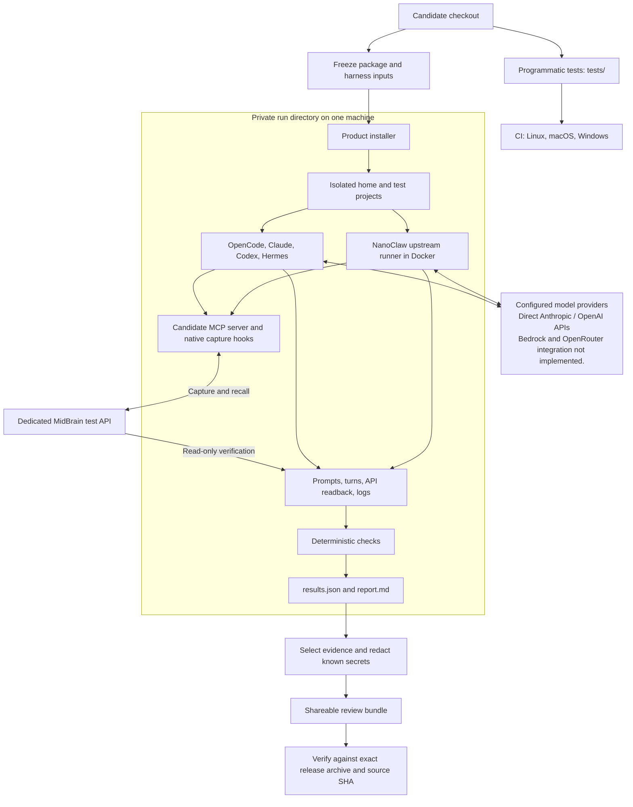
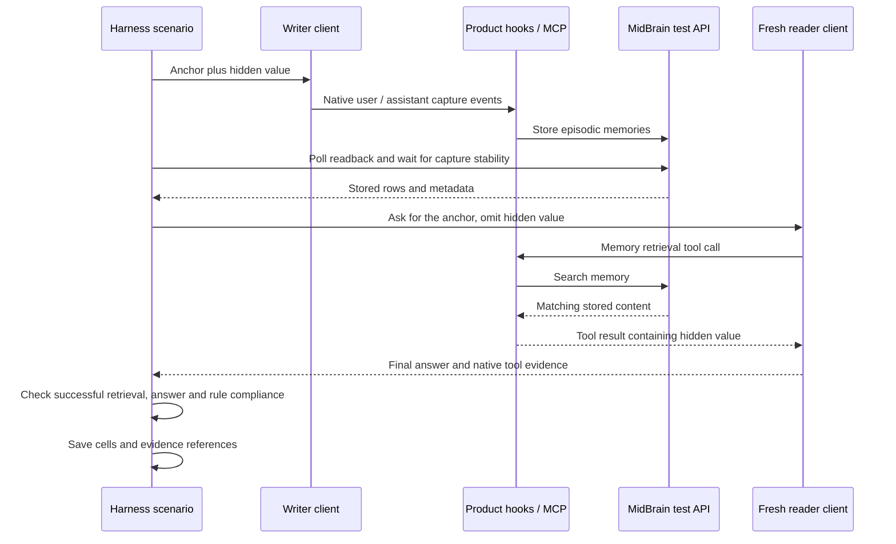
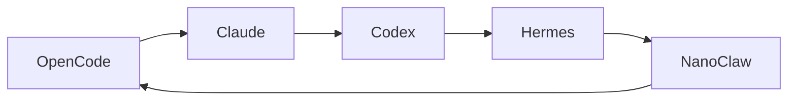
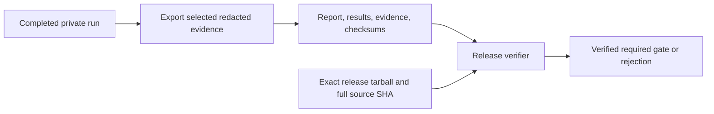

# Multi-client testing: architecture, operation and release evidence

Companion to the [design and coverage map](multi-client-harness.md),
[CLI commands](../../harness/README.md), and [workflow setup](behavioral-ci.md).
Updated 2026-09-10 against branch `multi-client-harness-review`.

Start with [architecture](#architecture) to understand the system, [local setup](#local-setup)
to prepare a machine, [run recipes](#choose-and-run-a-suite) to execute it, or
[reading results](#how-to-read-and-parse-results) to investigate an existing run.
For changes to coverage, see [prompt locations](#where-to-find-and-edit-the-prompts).
For command options, see the [argument reference](#commands-and-arguments).

## What it is

The harness tests a release candidate of `midbrain-memory-mcp` against defined checks in five
real AI clients: OpenCode, Claude Code, Codex, Hermes and NanoClaw. Behavioral runs use real
models, product hooks and the MidBrain API, with controlled fixtures and a local NanoClaw
mailbox transport. Unit tests separately mock dependencies to test harness logic.

It builds the candidate into a tarball, lets the product's own installer configure real client
installs inside a throwaway home, drives real model sessions with fixed prompts, and scores
what actually happened from raw evidence: rows read back from the MidBrain API, tool calls in
the client's own transcript, and the product's hook logs. The result is one side-by-side
PASS / FAIL / BLOCKED matrix per run. Implemented scenarios are not proof of a passing
release: the complete required matrix still needs to pass on the intended candidate.

NanoClaw coverage uses its upstream runner through the local mailbox; external messaging
integrations and the full host dispatcher are not exercised.

## Architecture

There are two complementary test lanes. The existing programmatic suite checks installation,
configuration, credentials, tools, repair, recovery, packaging and isolation in code. Its
[CI workflow](../../.github/workflows/ci.yml) runs tests on Linux, macOS and Windows.
The behavioral harness checks whether real clients actually capture and use memory in
model sessions. A green programmatic suite does not establish a green behavioral matrix.



The harness controls prompts and collects evidence; the **product** performs memory writes
and retrieval. Its verification API client reads stored rows independently. This separates
“the assistant said it remembered” from “the right value appeared in a successful memory
tool result and in the answer.” Both the provider APIs and the memory backend are real in
a behavioral run. A local memory backend removes the MidBrain cloud dependency, but client
model calls still use their configured providers.

### Why these boundaries exist

| Boundary | Reason |
|---|---|
| Product adapters vs harness manifests | Product adapters install and repair integrations; harness manifests launch clients and interpret their evidence. Client CLI changes should stay in the driver. |
| Frozen package vs live checkout | Sessions execute preserved candidate bytes, so an edit during a long run cannot silently change the tested product. Recorded input changes fail checks. |
| Private home vs real home | Configuration, credentials, projects and caches belong to this run. A before/after tripwire detects changes to enumerated host surfaces. It is detection, not a security sandbox. |
| Native hooks vs verification readback | Hook execution must come from the client. Readback proves what reached the API; the harness does not replay a failed hook to manufacture a pass. |
| Scenarios vs scoring vs rendering | Prompts exercise behavior, checks evaluate evidence, and the report displays those checks. Export reuses the same results and renderer. |
| Private run vs shareable bundle | Debugging needs detailed local evidence. Review needs selected, redacted evidence and candidate identity, without credential-bearing homes. |

### Capture and cross-client recall, end to end

This illustrates one S2 pair. The hidden value is supplied only to the writer; the reader
gets the retrieval anchor. A new reader session prevents conversation history from supplying
the answer. S1 separately checks capture counts and metadata in detail.



Model behavior remains variable. Deterministic scoring means the same evidence receives
the same checks; it does not promise identical answers, tokens or latency on every run.

## One run, step by step

1. **Doctor (separate preflight command).** Checks client binaries, secrets, that the
   MidBrain API answers with the harness key, and that the run root is durable and outside
   temp directories (the product skips self-repair from temp directories).
2. **Freeze the candidate.** `npm pack` the checkout, extract it, `npm ci` its runtime, hash
   the package source and selected harness runtime files. Recorded hashes and tarball bytes
   are checked before and after each shared `runTurn` call. The snapshot excludes
   `node_modules` and dotfiles; it does not detect newly added files or freeze provider behavior.
3. **Build a throwaway home.** A fresh `$HOME` under the run directory with detection fixtures
   for the selected clients (an empty `~/.claude/settings.json`, a `~/.codex/` dir, and so on),
   a pre-seeded MidBrain key, and three project dirs (`proj-a`, `proj-b`, `proj-c`). Children
   get an isolated home and scrubbed environment; the selected adapter explicitly adds its
   test credentials and required settings. Local Codex ChatGPT mode explicitly copies host
   login credentials into the run home; the workflow uses API-key authentication instead.
4. **Registry mode (optional).** Start a loopback Verdaccio that proxies npmjs but serves the
   candidate as `latest`. With `--upgrade` it first installs the previous published release,
   captures on it, then publishes the candidate and upgrades through the product's documented
   path. Dev mode instead points clients at the extracted candidate with `install.mjs --dev`.
5. **Install.** Run the product's real `install.mjs` inside the throwaway home. Then ask the
   product's own client adapters whether each install is present and "fresh" (canonical hooks,
   plugin, shim).
6. **Scenarios, in a fixed order.** S1 capture, S6 no-match, S8 literal markers, S3 fresh-session
   continuity, S2 cross-client recall (every ordered pair by default; one cycle with `--simple`), S5 current-vs-stale,
   S4 project/global isolation, S9 upgrade continuity, S10 client-specific cases. The S9
   upgrade prelude runs before this sequence. Clients execute real sessions; exact prompts,
   raw streams and normalised turns are saved. Capture and recall scenarios use markers,
   API polling, settling and indexing waits where needed. S6 asks an unrelated question
   without a marker or API readback; not every turn has all these evidence files.
7. **Score.** Each scenario emits cells: named checks, all deterministic, no model-as-judge.
   PASS means every check passed. BLOCKED means a prerequisite was missing (binary, secret,
   Docker, approval support, provider billing error). Failed cells are not automatically
   rerun until green. Polling retries transient reads, and NanoClaw may natively retry
   response formatting; every native reply must still be captured exactly once. See [failure handling](#missing-prerequisites-and-failure-handling) for client setup, aborts and partial results.
8. **Tripwire and report.** Hash enumerated host config surfaces before and after; detected drift
   fails the run. Render `report.md` and `results.json`. Exit 0 only when every cell is PASS
   and isolation is clean. `--required` additionally requires registry+upgrade mode and the
   full client/scenario selection. A focused green run is only a checkpoint.

## Missing prerequisites and failure handling

The harness launches selected clients and handles known failure cases with explicit checks. It does not autonomously troubleshoot the machine or install every missing prerequisite. A failure can affect one client, one scenario, or the whole run.

| Situation | What the harness does |
|---|---|
| OpenCode or Hermes is not installed | Installs a run-local copy using npm or uv, respectively. Those package managers must already be available; the harness does not install them. |
| Claude Code or Codex is missing; a client prerequisite or provider credential is missing | Marks that client BLOCKED with the reason and continues with runnable clients. This also applies when a run-local client install or preflight fails. Cross-client coverage affected by unavailable clients is recorded as BLOCKED. |
| Docker is unavailable for NanoClaw | Marks NanoClaw BLOCKED and continues with the other runnable clients. With prerequisites available, the default preparation path clones the pinned runner and builds its image; a configured prepared image must already be present. |
| Client setup fails after the product installer | Records a failed Clean install check for that client and blocks its later scenarios. Other runnable clients continue. |
| A scenario cannot run or throws an error | Catches the error at the scenario boundary, records BLOCKED for an explicit dependency error or FAIL for an unexpected harness error, then continues the remaining scenarios. |
| A command takes too long or memory readback is delayed | Client commands have timeouts. Readback polls within a bounded window and can tolerate transient read errors; exhausted waits are evaluated by the scenario checks. Failed cells are not automatically rerun until green. |
| The shared MidBrain key is missing, the initial API probe fails, or run options are invalid | Stops the whole run with an error and nonzero exit. There is no automatic cloud-to-local fallback. Local hosting requires separately starting the backend and seeding its keys before running the harness. |
| An error escapes the per-client or per-scenario handlers | Can abort the run before results.json and report.md are produced. Candidate packaging, registry startup, filesystem operations, or final verification can fail outside those handlers; a complete report is not guaranteed. |

Run `node harness/run.mjs doctor` before a costly run to inspect prerequisites. Doctor is a separate command, not an automatic repair step. Its READY summary means at least one client is runnable and shared checks passed; inspect every client row for BLOCKED entries.

The harness writes `results.partial.json` after each completed scenario across its selected clients or pairs. After an interruption, that checkpoint may omit the scenario that was in progress; an early setup failure may leave no checkpoint. Preserve the existing evidence for diagnosis, fix the reported cause, and start a new run. Partial results are not a completed run or release evidence.

Run cleanup is attempted on normal completion, errors inside the run cleanup scope, and handled SIGINT/SIGTERM. It stops the loopback registry and removes owned NanoClaw containers; the private run directory remains for inspection. SIGKILL or host failure can prevent cleanup, and the separately started local backend stays running until explicitly stopped.

Continuing after a failure does not make the run successful: FAIL, BLOCKED, SKIP, an empty run, or detected real-home drift produce a nonzero exit. Product self-repair exercised by the scenarios is separate from the harness handling its own infrastructure failures.

## What each file does

All paths below are relative to this repository. The harness is development tooling;
`package.json` does not include `harness/` in the published npm package.

### Product under test

| Location | Responsibility and why it matters to testing |
|---|---|
| [index.js](../../index.js), [mcp.mjs](../../mcp.mjs) | CLI/MCP entry point and tool handlers. These are the actual tools invoked by client sessions. |
| [install.mjs](../../install.mjs), [shared/clients/](../../shared/clients/) | Installation, credential resolution, configuration and self-repair. Harness setup calls this product code instead of maintaining a second installer. |
| [shared/midbrain-api.mjs](../../shared/midbrain-api.mjs) | Product HTTP access to memory. Separate from the harness's read-only verification client. |
| [shared/agent-rules.mjs](../../shared/agent-rules.mjs) | Managed memory-first instructions. Behavioral compliance checks measure whether clients follow them. |
| [plugins/claude-code/](../../plugins/claude-code/), [plugins/codex/](../../plugins/codex/), [plugins/hermes/](../../plugins/hermes/) | Native capture handlers invoked by each client. |
| [plugins/opencode/midbrain-memory.ts](../../plugins/opencode/midbrain-memory.ts), [dist/midbrain-shared.mjs](../../dist/midbrain-shared.mjs) | OpenCode plugin and built runtime bundle, including capture completion at shutdown. |
| [skills/nanoclaw/](../../skills/nanoclaw/) | Product integration instructions/configuration for a NanoClaw group. NanoClaw uses the Claude capture handlers with its own client identity. |

Four product changes accompanied this testing work and require release review separately
from the harness: synchronous Claude Stop plus migration (`e4e2fc2`), recognized NanoClaw
envelope decoding (`5e9b9e4`), managed memory-first/full-anchor rules (`113016c`), and OpenCode
capture draining during plugin disposal (`0dd4826`). See the
[release review boundaries](multi-client-harness.md#release-review-for-the-hardening-changes) for details.
Commit titles were normalized on 2026-09-10. Earlier documents and run evidence retain the
original SHAs (`f84c5f6`, `5b1f1fe`, `477bd79`, `03b6271` respectively); that history is
preserved on `multi-client-harness-review-before-retitle`. Rewording a commit does not make
an old report validate the new source SHA.

### Entry point and libraries

| File | Role |
|---|---|
| `harness/run.mjs` | The CLI: `doctor`, `freeze`, `run`, `report`. Owns the run lifecycle above, signal handling and cleanup. |
| `harness/lib/context.mjs` | Run identity (id, marker like `MBH-A27DDB`), run directories, and the scrubbed child environment. |
| `harness/lib/env.mjs` | Loads `harness/.env` into absent or empty environment variables; nonempty values win. |
| `harness/lib/candidate.mjs` | Packs the candidate, extracts it, installs its runtime, snapshots file hashes, asserts they are unchanged. |
| `harness/lib/home.mjs` | Builds the throwaway home, seeds detection fixtures and the global key, runs the real installer, inspects installs. |
| `harness/lib/inspect-install.mjs` | Tiny script executed inside the throwaway home that loads the product's own adapters and reports installed/fresh. |
| `harness/lib/registry.mjs` | Loopback Verdaccio: config, start/stop, pack and publish the candidate, pick an rc version when the version already exists upstream. |
| `harness/lib/upgrade.mjs` | The S9 prelude: capture on the previous release, publish, clear npx cache, upgrade, verify fresh install and recall of pre-upgrade memory. |
| `harness/lib/api.mjs` | Read-only MidBrain client used to verify: list episodic rows since a time, poll until a predicate holds, settle window. |
| `harness/lib/checks.mjs` | Check helpers and status rules: memory-first compliance, hidden-value recall, JSON current-answer, capture counts, exit code. |
| `harness/lib/evidence.mjs` | Copies transcripts and logs, counts cache/spool files, hashes config shape for the report. |
| `harness/lib/tripwire.mjs` | Real-home isolation: snapshot and diff of the host's config surfaces, reusing the Vitest tripwire list. |
| `harness/lib/proc.mjs` | Spawn with hard timeout, stdin, NDJSON line capture. |
| `harness/lib/report.mjs` | Renders the side-by-side matrix and per-cell detail to Markdown; defines the row order. |
| `harness/lib/codex-approval.mjs` | Validates the three installed hooks through Codex, invokes native approval, then verifies unchanged hashes and persisted trust in a fresh process. |
| `harness/lib/codex-approval-pty.py` | Python standard-library terminal driver for the pinned Codex hook browser; bounded timeout and child cleanup. |
| `harness/scripts/release-evidence.mjs` | Exports selected redacted evidence and verifies the required gate against a source SHA and exact archive. |
| `harness/scripts/ci-evidence.mjs` | Builds the GitHub summary and bundle; incomplete runs receive an incomplete summary, not passing evidence. |
| `harness/lib/nanoclaw.mjs` | The NanoClaw runtime: clones a pinned upstream revision, builds or reuses its image, creates groups, runs one container per turn, collects transcripts. |
| `harness/lib/nanoclaw-mailbox.mjs` | The SQLite mailbox NanoClaw reads from and writes to; the harness enqueues inbound messages and reads replies. Needs Node 24. |
| `harness/lib/nanoclaw-package.mjs` | Pinned upstream identity and validation contract for an optional self-contained runtime image. |
| `harness/scripts/prepare-nanoclaw.mjs`, `harness/container/Dockerfile` | Build a local packaging layer containing the runner, host assets and upstream license; produce a manifest without running models or publishing. |
| `harness/container/nanoclaw-probe.mjs` | Runs inside the NanoClaw image to list MCP tools; a readiness probe, not behavioural evidence. |
| `harness/scripts/local-stack.sh` | `up`, `seed`, `status`, `down` for the local MidBrain API stack from the `memory` repo via docker compose; `seed` mints two test agents into `.env`. |

### Client manifests (`harness/clients/`)

One file per client. Each exports a manifest: id, supported OSes, how to install, detection
fixtures, config surfaces, capabilities, known exceptions, client-specific case names, the
environment to give the child, `preflight`, `version`, `runTurn` (returns a normalised turn:
final text, tool calls with inputs and results, session id, exit state), and `evidence`.
Register the manifest in `index.mjs` to reuse shared scenarios and reporting. New
client-specific behavior can require additional cases; those are declared by the adapter.

| File | Driver mechanism |
|---|---|
| `claude.mjs` | `claude -p --output-format stream-json`, `--session-id` / `--resume`, parses tool_use and tool_result blocks, copies transcripts. |
| `codex.mjs` | `codex exec --json`, ChatGPT-login reuse or `codex login --with-api-key`, hook-trust bypass for ordinary turns; the persisted-trust case automates native UI approval by default; use `--interactive` for manual approval. |
| `opencode.mjs` | Installed run-locally with npm, driven with `opencode run`, native stream parsed, truncated tool output recovered from its output files. |
| `hermes.mjs` | Installed run-locally with `uv tool install hermes-agent[mcp]`, `hermes chat -q`, evidence from its session export, hook consent toggle. |
| `nanoclaw.mjs` | Thin manifest over `lib/nanoclaw.mjs`; owns the NanoClaw lifecycle cases. |

### Scenarios (`harness/scenarios/`)

| File | What it checks |
|---|---|
| `_shared.mjs` | `runTurn` (persists prompt, turn, asserts frozen inputs), `readback` (poll by marker), metadata and turn checks, cell constructor. |
| `index.mjs` | Execution order. |
| `s01-capture.mjs` | User and assistant rows reach the API with matching client/session/cwd metadata and marker text. Exactly one user capture and one capture per native assistant reply. |
| `s02-cross-client-recall.mjs` | Writer stores a hidden value; another client's fresh session must retrieve it through a MidBrain call. Each writer stores one checkpoint that every reader reads (five writes, twenty reads). All ordered pairs by default; `--simple` selects one directed cycle. |
| `s03-fresh-session-continuity.mjs` | A checkpoint written in one session is recovered in a new session of the same client. In simple mode with the upgrade prelude, scored on the prelude's own write and fresh-session recall. |
| `s04-project-global-isolation.mjs` | Project-scoped key isolates from global; global fallback works from an unscoped directory. The global marker is S1's capture (same project and credential), so only the project write is new. |
| `s05-freshness-reconciliation.mjs` | After an update, a new session names the current value as current, as JSON, citing memory evidence. Conflicting live repository/file state is not tested. |
| `s06-no-match-clean.mjs` | An unrelated question gets a clean answer with no memory process language; it does not force an unsuccessful memory lookup. |
| `s08-marker-robustness.mjs` | Marker-like literal text survives the round trip unchanged. |
| `s09-upgrade-continuity.mjs` | Surfaces the prelude's cells; BLOCKED outside registry+upgrade mode. |
| `s10-client-specific.mjs` | Self-repair of a stale shim, cold first turn in a fresh home, Claude hook ordering, Codex persisted trust, Hermes consent, OpenCode plugin without MCP. |
| `nanoclaw-lifecycle.mjs` | NanoClaw cold wake, continuation resume across containers, legacy opener recovery. |

S7 is the memory-first/full-anchor compliance checks used inside S2, S3 and S5; there is
no separate S7 driver to select. S4 uses two different test agents and scoped projects;
its current reader turns do not cover every possible direction of scope leakage. See the
[coverage map](multi-client-harness.md#5-behavioral-coverage-and-prompt-ownership) for precise
assertions and gaps relative to the maintainer's manual scenarios.

### NanoClaw's container boundary

The manifest drives the pinned upstream v2 runner at
`6656b326a900dcfba4be8ca76412d954cfc915b5`. The local SQLite mailbox replaces messaging
delivery, while the upstream Claude provider, SDK, MCP connection and hook execution run
normally. Each turn gets a new container. Resumed sessions preserve their continuation and
durable group state, including `.claude-shared` and npm cache mounts. The model's project is
`/workspace/agent`, with isolated agent files rather than host project files.

Linux defaults to Docker host networking for the loopback registry; Docker Desktop uses
`host.docker.internal`. A custom network or remote Docker daemon needs reachable API/registry
URLs and valid host bind mounts; the overrides are in [the env template](../../harness/.env.example).
The first run may clone source and build an image. `nanoclaw.json` records source/image identity.
With a prepared image manifest, the harness skips source cloning/building and runs the source
baked into that image instead of mounting it from a checkout. Both paths use the same scenarios.

NanoClaw can produce another native assistant reply while retrying response formatting.
Capture checks expect one capture per distinct native reply. This is a documented client
exception, not permission to ignore duplicate captures. The lane excludes Slack/WhatsApp
delivery, host routing, OneCLI provisioning and other NanoClaw providers. Its legacy case
reconstructs the old missing-shim/marker configuration, not an entire historical deployment.

### Tests and docs

`tests/harness-lib.test.mjs`, `harness-scoring.test.mjs`, `harness-nanoclaw.test.mjs`,
`harness-hermes.test.mjs`, `harness-opencode.test.mjs` unit-test the scoring, parsing and
isolation logic without model calls. `tests/fixtures/nanoclaw/` holds the upstream mailbox
schema. `tests/harness-codex-approval.test.mjs` covers approval guards and offers an
opt-in real-CLI check without model calls; `harness-release-evidence.test.mjs` and
`harness-ci-evidence.test.mjs` cover export, redaction and gate preservation.
`tests/harness-simple.test.mjs` covers cycle selection, unavailable clients and mode labels.
`tests/harness-nanoclaw-package.test.mjs` checks package identity, asset integrity, cleanup
and loading without source preparation.
The [design](multi-client-harness.md) records coverage limits and manual-checklist gaps;
[validation notes](validation-2026-09-08.md) preserve earlier run outcomes.

## Where to find and edit the prompts

**Prompt templates live in code, not in a separate prompt file or the client manifests.**
The scenario builds each prompt with the run marker and, where needed, fresh hidden values.
The same shared scenario runs against each selected client's driver. NanoClaw lifecycle
cases and the upgrade prelude have their own prompt definitions.

| Prompt family | Source to edit |
|---|---|
| S1 capture | [harness/scenarios/s01-capture.mjs](../../harness/scenarios/s01-capture.mjs) — `prompt` |
| S2 cross-client writer and reader | [harness/scenarios/s02-cross-client-recall.mjs](../../harness/scenarios/s02-cross-client-recall.mjs) — `writePrompt` and `readPrompt` |
| S3 fresh-session checkpoint and recall | [harness/scenarios/s03-fresh-session-continuity.mjs](../../harness/scenarios/s03-fresh-session-continuity.mjs) — `p1` and `p2` |
| S4 project/global scope | [harness/scenarios/s04-project-global-isolation.mjs](../../harness/scenarios/s04-project-global-isolation.mjs) |
| S5 current vs stale value | [harness/scenarios/s05-freshness-reconciliation.mjs](../../harness/scenarios/s05-freshness-reconciliation.mjs) |
| S6 clean unrelated answer | [harness/scenarios/s06-no-match-clean.mjs](../../harness/scenarios/s06-no-match-clean.mjs) |
| S8 literal markers | [harness/scenarios/s08-marker-robustness.mjs](../../harness/scenarios/s08-marker-robustness.mjs) |
| S9 previous-release capture, new capture and recall | [harness/lib/upgrade.mjs](../../harness/lib/upgrade.mjs) — the S9 scenario file reports the prelude's results |
| S10 native approval, consent, repair and plugin cases | [harness/scenarios/s10-client-specific.mjs](../../harness/scenarios/s10-client-specific.mjs) |
| NanoClaw cold wake, resume and legacy opener | [harness/scenarios/nanoclaw-lifecycle.mjs](../../harness/scenarios/nanoclaw-lifecycle.mjs) |

For example, S2's source templates are:

```js
const writePrompt = `Checkpoint for task ${m}: the verification value is ${value}. Remember it and acknowledge briefly.`;
const readPrompt = `Search your MidBrain memory for task ${m} and tell me its exact verification value and which client recorded it. Do not guess; if it is not in memory say "not found after search".`;
```

`${m}` is the retrieval anchor; `${value}` is generated for the writer. The reader must
recover the value through MidBrain. Giving the value to the reader would invalidate the test.
`--simple` selects fewer S2 pairs; it uses these same prompts and checks.

To inspect **what was actually sent**, open the private run's
`evidence/<client>/<scenario>/<label>.prompt.json`. The shared
[runTurn helper](../../harness/scenarios/_shared.mjs) writes this before launching the client.
For example, OpenCode writing for Claude in S2 produces
`evidence/opencode/s02-cross-client-recall/write.prompt.json` (one shared write per writer).
The file includes `prompt`, `project` and session/resume options. A saved prompt alone does
not prove execution completed; check its normalized turn and result cells too.

These files record the harness's input, not the entire provider request. Client instructions,
tool definitions, conversation history and NanoClaw transport wrappers can add context.
Inspect native evidence when those additional inputs matter. S7 has no separate prompt:
its compliance checks operate inside S2/S3/S5.

When editing a prompt, review its expected outcome and deterministic checks together, keep
hidden values out of reader prompts, then run the focused scenario. Keep the old evidence;
a prompt change needs a new run. There is no CLI `--prompt` override.

## What a run leaves behind

```
<run-root>/runs/<run-id>/
  candidate.json, candidate/   frozen identity, tarball, extracted runtime, harness snapshot
  home/                        the throwaway home (contains credentials; never upload)
  logs/                        product hook and server logs at debug level
  evidence/<client>/<scenario>/ raw stream, normalised turn, prompt, API read-back
  results.json, report.md      every cell with checks and evidence paths; the matrix
  isolation.json               real-home tripwire diff
  registry/, nanoclaw.json     loopback registry state; NanoClaw image and source identity
```

Local runs retain this directory for investigation. Normal completion, handled interruption
and timeout cleanup stop the registry and remove run-owned NanoClaw containers; images remain
cached. A killed process or failed host may prevent cleanup. Test memories also remain in the
dedicated backend agents. Neither local run directories nor backend memory are automatically
deleted after a successful local run.

## Local setup

The commands in this page run from the repository root in Bash/zsh on macOS or Linux.
Use Node 24 for the complete harness (NanoClaw uses `node:sqlite`), npm, Git, Python 3,
`uv`, and a working Docker daemon. The product itself supports Node 20+, but that is not
the prerequisite for the complete test harness. These instructions do not establish Windows
behavioral support; the programmatic CI OS matrix is separate.

### 1. Install dependencies and pinned client CLIs

The following installs Claude/Codex into a harness-owned directory rather than changing
global client installations. OpenCode and Hermes are installed by their adapters per run;
Hermes includes its required MCP extra. Network access to package/image registries, upstream
NanoClaw source, the model providers and the test API is needed.

```bash
npm ci
export MIDBRAIN_HARNESS_ROOT="$HOME/.midbrain-harness"
npm install --prefix "$MIDBRAIN_HARNESS_ROOT/clients" --no-audit --no-fund --no-save \
  @anthropic-ai/claude-code@2.1.258 @openai/codex@0.150.1
export PATH="$MIDBRAIN_HARNESS_ROOT/clients/node_modules/.bin:$PATH"
node --version
python3 --version
uv --version
docker info
```

Keep the run root outside `/tmp` and other temporary directories: product self-repair skips
temporary installations. These pins match the checked-in behavioral workflow at this page's
update date. Review changes to the pins together with the relevant adapters.

### 2. Configure dedicated test credentials and the backend

Create the gitignored config only if it does not exist, then edit it locally:

```bash
if [ ! -e harness/.env ]; then
  (umask 077; cp harness/.env.example harness/.env)
fi
chmod 600 harness/.env
```

| Setting | What to put there |
|---|---|
| `MIDBRAIN_HARNESS_API_URL` | Explicit non-production API URL, reachable from the host and NanoClaw containers. Set it even though local CLI configuration permits a default. |
| `MIDBRAIN_HARNESS_API_KEY` | Dedicated global test agent key; keys matching real-home key files are refused. |
| `MIDBRAIN_HARNESS_PROJECT_API_KEY` | A second, different test agent key. Required for S4 and a passing complete matrix. |
| `ANTHROPIC_API_KEY` | Provider credential for Claude, OpenCode, Hermes and NanoClaw with the model configuration below. |
| `OPENAI_API_KEY` | Provider credential for Codex in API-key mode. |

The loader fills absent or empty environment variables from `.env`; nonempty shell values
win. Do not paste secrets into commands or reports. Local Codex optionally supports
`MIDBRAIN_HARNESS_CODEX_AUTH=chatgpt`, which explicitly copies host login credentials into
the private run home. The reproducible workflow path uses `apikey` instead.

For the sibling local `memory` repository, these explicit setup operations start its Docker
stack and create two test agents, writing their keys and API URL into `harness/.env`:

```bash
bash harness/scripts/local-stack.sh up
bash harness/scripts/local-stack.sh seed
bash harness/scripts/local-stack.sh status
```

Set `MIDBRAIN_MEMORY_REPO` to an absolute path if the backend is not at `../memory`.
Seed during initial setup; it is not a required step before each test run. Add the provider
keys afterward. Use `bash harness/scripts/local-stack.sh down` when finished with the local
backend; data persists. For an existing staging API, configure its dedicated keys directly
and skip this helper.

### Optional: prepare NanoClaw once, then reuse or transfer it

The default path still fetches the pinned upstream checkout and builds/reuses its base image.
To make the NanoClaw runtime self-contained, run this separate preparation command from the
repository root. It needs Git, Docker and build-time network access, but no provider keys,
MidBrain API or model calls. The destination's parent must exist; the destination itself
must be new so an earlier package cannot be overwritten.

```bash
mkdir -p "$HOME/.midbrain-harness/packages"
node harness/scripts/prepare-nanoclaw.mjs "$HOME/.midbrain-harness/packages/nanoclaw"
export MIDBRAIN_HARNESS_NANOCLAW_MANIFEST="$HOME/.midbrain-harness/packages/nanoclaw/nanoclaw-image.json"
```

The command reuses the existing source/base-image preparation, then adds an unmodified
runner source tree at `/app/src` and the host's required files under `/opt/midbrain-harness`:
agent instructions, mailbox schema, dependency lockfile and upstream license. Only selected
tracked source files enter the image; no test homes, keys, sessions or captured memories do.
It writes `nanoclaw-image.json` and `NANOCLAW-LICENSE` into the output directory. The image
stays in local Docker storage, rather than being embedded in those small files.

The manifest pins the image's immutable SHA-256 ID, upstream revision, Linux architecture,
lockfile hash and each host asset's hash. On load, the harness inspects that exact local
image, verifies its identity, copies the four host assets from a stopped container and checks
their hashes, then removes the temporary container. The runner source executes from the image;
no NanoClaw checkout is needed. Missing/mismatched images or assets fail before client turns,
without silently falling back to a build. `nanoclaw.json` records `packaged` and `platform`.

`MIDBRAIN_HARNESS_NANOCLAW_MANIFEST` takes precedence over the legacy `SOURCE`/`IMAGE`
overrides. Unset it to restore the default path. Preparation itself uses `SOURCE`/`IMAGE`
when provided, allowing reuse of a clean pinned checkout and matching base image. The
preparation command does not load `harness/.env`; export those optional overrides explicitly.

For transfer to another machine, save the image alongside the manifest and license:

```bash
package_dir="$HOME/.midbrain-harness/packages/nanoclaw"
image_id=$(node --input-type=module -e \
  'import fs from "node:fs"; console.log(JSON.parse(fs.readFileSync(process.argv[1])).imageId)' \
  "$package_dir/nanoclaw-image.json")
docker image save -o "$package_dir/nanoclaw-image.tar" "$image_id"
```

Copy that directory to a machine with the same Docker image architecture, then:

```bash
package_dir="/absolute/path/to/copied-nanoclaw-package"
docker image load -i "$package_dir/nanoclaw-image.tar"
export MIDBRAIN_HARNESS_NANOCLAW_MANIFEST="$package_dir/nanoclaw-image.json"
node harness/run.mjs doctor --clients nanoclaw
node harness/run.mjs run --mode registry --clients nanoclaw --scenarios s01,s06
```

The last command makes real model calls and requires the normal test credentials/backend.
Package separately for Linux AMD64 and ARM64; this command builds for the current Docker
daemon's default platform. Identity matching is not a publisher signature: use a trusted
image/manifest pair. Rebuilding the upstream base can change image bytes even at the same
source revision; retaining the built image preserves the exact runtime.

This packages the NanoClaw lane, not the entire test environment. Docker, Node 24, the harness,
model providers, the test API and candidate npm installation are still needed. No image
registry publication or workflow deployment is performed. The checked-in GitHub workflow
continues to use default source preparation until a prepared image is provisioned and the
manifest environment variable is configured on its runner.

Packaging validation (2026-09-10): unit tests cover the build context, manifest/asset
verification, source-free loading and cleanup. A local image build was attempted, but the
Docker daemon remained unreachable after `docker desktop start`; no prepared image or live
packaged-run pass has been recorded yet. Existing behavioral results predate this option.

### 3. Pin models and check readiness

This configuration matches the workflow's default model choices. Export it in the shell
used for the run, or place these values in `harness/.env` without the `export` prefix:

```bash
export MIDBRAIN_HARNESS_CLAUDE_MODEL=claude-haiku-4-5
export MIDBRAIN_HARNESS_OPENCODE_MODEL=anthropic/claude-haiku-4-5
export MIDBRAIN_HARNESS_HERMES_PROVIDER=anthropic
export MIDBRAIN_HARNESS_HERMES_MODEL=claude-haiku-4-5
export MIDBRAIN_HARNESS_NANOCLAW_MODEL=claude-haiku-4-5
export MIDBRAIN_HARNESS_CODEX_MODEL=gpt-5.6-sol
export MIDBRAIN_HARNESS_CODEX_AUTH=apikey
export MIDBRAIN_HARNESS_OPENCODE_VERSION=1.18.29
export MIDBRAIN_HARNESS_HERMES_VERSION=0.19.0
export MIDBRAIN_HARNESS_VERDACCIO=verdaccio@6.2.0
node harness/run.mjs doctor
```

Inspect **every client's verdict**, the project key and API probe. Doctor can report READY
with only a subset runnable; its exit code alone does not certify readiness for the required
matrix. It does not make paid model calls or guarantee model access or provider balance.
Use `doctor --clients claude,codex` when intentionally preparing only that subset.

Costs depend on model tokens, tool results, context, caching and native retries. A scenario
can launch several fresh sessions, and a prompt can require several provider calls. A
report cell is an assertion group, not a billable model call. The four Anthropic clients
and API-authenticated Codex bill their respective providers; runner costs are separate.

The workflow also offers `claude-sonnet-5` for the four Anthropic-backed clients. These are
the model identifiers configured in the repository, not a claim that every account has
access or that either model has produced a green required gate. Switching models changes
the tested configuration and requires new evidence.

## Cost and duration by run type

These are historical observations from local runs, not all-inclusive budgets. Wall-clock
figures come from completed run metadata; spend is approximate, as recorded in the
[historical review](review-2026-09-09.md#cost-and-model-choice). Claude/OpenCode expose cost
fields, NanoClaw estimates use transcript usage, and Hermes accounting is incomplete.
Codex costs, runner charges and backend costs are excluded from the Anthropic figures.
The historical Codex runs used a ChatGPT login; the workflow uses separately billed OpenAI API auth.

| Run type | Scope and models | Observed duration | Historical Anthropic spend | Evidence / limitation |
|---|---|---|---|---|
| Programmatic | Build, lint, tests, isolation; no models | Varies by machine; recent local checks under 2 min | $0 model usage | Not a behavioral matrix; runner compute still has a cost. |
| Smoke | Claude, OpenCode, Hermes, NanoClaw; Haiku 4.5; S1/S6; dev mode | About 2 min | Under $0.15 | `20260909-083217-0fbb`; eight prompts, excludes Codex, differs from five-client workflow smoke. |
| Focused | One/two clients and selected scenarios | Depends on selection; one retained run took about 6 min | Varies | `20260908-090053-5472`; a targeted run is not comparable to full coverage. |
| **Simple (Default)** | Five clients, all scenarios, upgrades, five S2 links | Not yet measured in a completed run recorded here | Not yet measured | Recommended for everyday behavioral checks. Saves 30 S2 prompts; no measured simple/full token-cost ratio. |
| **Full matrix** | Five clients, Haiku 4.5 for Anthropic clients; upgrades, 20 S2 pairs | About 83 min | About $2 | Broader cross-client confidence. `20260909-083452-4fdd`; 108 PASS / 16 FAIL / 1 BLOCKED, non-required checkpoint. |
| Required attempt | Claude Opus 5 (1M), OpenCode Sonnet 4.6, Hermes/NanoClaw Sonnet 4.5 | About 116 min | About $10 | `20260908-093157-c670`; 93 PASS / 27 FAIL / 1 BLOCKED. This was a mixed-model run, not an all-Opus comparison. |

Fixed indexing/readback waits, container startup, tool output, model latency, context and
native retries all affect the total. A prompt can trigger several provider calls, so neither
prompt count nor the number of result cells is a reliable bill by itself.

### Model prices and planning estimates

Anthropic's standard Claude API rates, checked 2026-09-10, are below in USD per million
tokens. [Official pricing](https://platform.claude.com/docs/en/about-claude/pricing).

| Model | Uncached input | 5-minute cache write | 1-hour cache write | Cache read | Output |
|---|---|---|---|---|---|
| Haiku 4.5 | $1 | $1.25 | $2 | $0.10 | $5 |
| Sonnet 5 | $2 | $2.50 | $4 | $0.20 | $10 |

**Illustrative estimate:** holding token counts and cache categories constant, Sonnet 5 costs
2× Haiku 4.5 at these rates. The historical approximately $2 Haiku broad run would therefore
translate to approximately $4 for its Anthropic portion under that assumption. This is not
an observed Sonnet result or a spending cap. Anthropic notes tokenizer differences in newer
models; actual token counts, answers, tool calls and retries can change.
[Pricing and tokenizer notes](https://platform.claude.com/docs/en/about-claude/pricing).

For your own estimate, use `sum(tokens_in_category × category_rate / 1,000,000)` across clients,
then add Codex API usage and runner/backend charges. Check account-specific pricing before
budgeting. No completed simple-mode cost measurement is recorded here, so do not scale the
whole bill by its 75% reduction in S2 pairs. The harness has no dollar-budget flag or automatic
billing cutoff; timeouts limit duration, not spend.

The workflow offers Haiku 4.5 and Sonnet 5 for the Anthropic clients. Neither a cheaper model
nor a more capable model automatically establishes sign-off: record the selected models and
obtain a passing required run. Marker, recall and format failures remain failures until
triaged; they are not automatically waived as model noise.

## Choose and run a suite

“Default” marks the recommended everyday choice in this guide; it does not change CLI or
GitHub workflow defaults. Select Simple explicitly with `--simple` or `suite=simple`.

The two main behavioral choices are **Simple** for everyday iteration and **Full matrix**
for exhaustive cross-client coverage. Simple keeps all implemented scenarios and upgrades,
but checks five S2 links instead of twenty; it can miss failures specific to the omitted
client pairs. Full matrix checks every ordered pair. For release evidence, run that full
matrix with `--required`, which enforces complete selection and registry+upgrade mode.
Required is a stricter use of the full matrix, not a larger suite or a premium model tier.

Keep programmatic checks as the no-model prerequisite. Smoke is useful for a first setup
check; focused runs help diagnose a failure. Neither needs to precede every Simple run.
The model-backed commands below incur provider usage; `npm run check` does not run a paid
behavioral matrix. These are coverage choices, not statistical confidence guarantees.

| Run | Purpose | Can establish the full required gate? |
|---|---|---|
| Programmatic | Build, lint, tests, docs and isolation gates | Separate prerequisite |
| Smoke | S1 capture and S6 clean unrelated answers in all five clients | No |
| **Simple (Default)** | Everyday behavioral checks: all scenarios and upgrades, with one cross-client cycle | No |
| **Full matrix** | Broader validation: all scenarios, upgrades and every ordered cross-client pair | Only when run as Required below |
| Required | Full matrix with enforced release-coverage requirements | Yes, if complete, all checks pass and evidence verifies |
| Focused | Selected clients/scenarios while diagnosing a failure | No |

“Light” means **simple** in this guide; there is no `--light` flag. Smoke is smaller again.
“Full” means all ordered pairs; use `--required` with registry+upgrade when collecting
release evidence. Omitting `--simple` alone does not mark the run as required.

Run each command as a separate operation; these are alternatives, not a script that must
execute all paid suites in sequence. Run from the repository root after completing
[local setup](#local-setup), pinning models and checking readiness.

```bash
# Programmatic checks
VITEST_MAX_WORKERS=4 npm run check
```

```bash
# Smoke: all five clients, two scenarios
node harness/run.mjs run --mode registry --scenarios s01,s06
```

```bash
# Simple: all scenarios, reduced cross-client pairing
node harness/run.mjs run --mode registry --upgrade --simple
```

```bash
# Full matrix: all scenarios and ordered pairs, without the required-gate designation
node harness/run.mjs run --mode registry --upgrade
```

```bash
# Required: full selection, including upgrades and native Codex approval
node harness/run.mjs run --mode registry --upgrade --required
```

```bash
# Focused: one cross-client comparison in both directions
node harness/run.mjs run --mode registry --clients codex,nanoclaw --scenarios s02
```

```bash
# Focused: previous-release upgrade continuity for Claude
node harness/run.mjs run --mode registry --upgrade --clients claude --scenarios s09
```

The default `dev` mode runs the extracted candidate directly. Registry mode exercises npm
resolution through a loopback Verdaccio registry; it does not publish to public npm. With
`--upgrade`, the harness captures on the previous published release first, publishes the
candidate locally, clears resolution caches and verifies upgrade continuity. S9 is blocked
without registry+upgrade; NanoClaw's legacy S10 case also needs registry mode.

`--required` rejects client/scenario filters and requires registry+upgrade. `--simple` changes
only S2 pair selection, cannot combine with `--required`, and follows this stable order:



With five clients, simple runs five writer/reader pairs and ten S2 prompts. Full mode runs
twenty ordered pairs with five shared writes and twenty reads, twenty-five S2 prompts. The
fifteen-prompt saving applies to S2, not the whole run or bill. In upgrade mode S1 also
scores the prelude's post-upgrade capture instead of repeating it, Claude's hook-ordering case
is derived from S1, S4 reuses S1's global write, and in simple mode S3 is scored on the
prelude's write-then-fresh-recall pair. A full upgrade matrix is 106 prompts rather than 132;
a simple run is 81 rather than 102. Every reused cell says so in its notes. Subsets form a cycle in the same manifest order; S2 needs at least two
clients. Unavailable clients keep their place in a simple cycle, and affected links are
BLOCKED. The planned links are recorded in `run.crossClientPairs`.

Native Codex hook approval runs automatically when its S10 case is selected. It requires
Python 3 and Codex 0.150.1 on Linux/macOS. It validates the
three installed MidBrain hooks, drives the native approval UI, and verifies unchanged hook
hashes and persisted trust in a fresh process. S10 checks no capture before approval and
capture afterward without bypass. Ordinary turns use the adapter's headless approval/trust
bypasses; those do not establish persisted trust. Use `--interactive` for manual terminal
approval instead. The old `--approve-codex-hooks` flag is accepted for compatibility but
is no longer needed. Missing prerequisites or failed approval still prevent this case from passing.

Default capture readback waits up to 90 seconds, polling every 5 seconds and checking a
5-second stable capture window; indexing grace is 20 seconds where used. Client turns default
to a 300-second timeout. These are waiting bounds, not automatic reruns of failed scenarios.
Tune through the documented env template/CLI flags only when investigating measured delays.
Record the changed configuration and keep the original failed run.

### Configure a run without a new suite format

Use the existing flags and model environment variables. A selected set of built-in scenarios
already serves as a custom suite; a separate JSON/YAML suite loader would add another format
to maintain without adding coverage. Save a frequently used command in a small shell script
if needed. New prompts or assertions belong in the versioned scenario drivers described in
[prompt locations](#where-to-find-and-edit-the-prompts).

| Setting | Local CLI | Current GitHub workflow |
|---|---|---|
| Suite / coverage | Combine `--clients`, `--scenarios`, `--simple`, and `--upgrade`; `--required` forbids filters and simple mode | `suite`: `smoke`, `simple`, or `required`; choose `required` for the full matrix |
| Models | Set `MIDBRAIN_HARNESS_<CLIENT>_MODEL` independently for `CLAUDE`, `OPENCODE`, `HERMES`, `NANOCLAW`, and `CODEX` | `anthropic_model`: `claude-haiku-4-5` or `claude-sonnet-5` for all four Anthropic clients; Codex is pinned to `gpt-5.6-sol` |
| OS | Runs on the actual host; there is no `--os` flag or OS emulation | Behavioral runner is fixed to self-hosted Linux; programmatic CI already tests Linux, macOS and Windows |
| Custom test suite file | No `--suite-file` or arbitrary scenario-file loader; select existing scenario IDs | No custom client/scenario inputs |

To test another OS, execute the harness on that OS with its prerequisites. NanoClaw still
runs in a Linux Docker container. Local recipes target macOS/Linux; Windows behavioral
support and the Linux workflow have not been established by the recorded validation.
Changing a runner label alone does not validate a new platform. Keep the existing
programmatic OS matrix and one behavioral host for now; expand behavioral platforms when
there is a concrete platform-specific failure or support requirement.

```bash
# Custom selection: capture, cross-client recall and answer cleanliness in two clients
# Inline model overrides apply to this command and take precedence over harness/.env.
MIDBRAIN_HARNESS_CLAUDE_MODEL=claude-haiku-4-5 \
MIDBRAIN_HARNESS_CODEX_MODEL=gpt-5.6-sol \
node harness/run.mjs run --mode registry --clients claude,codex --scenarios s01,s02,s06
```

Use the [model setup recipe](#3-pin-models-and-check-readiness) to pin all five clients before
a Simple or Full matrix run. OpenCode needs the provider prefix, for example
`anthropic/claude-haiku-4-5`; Hermes also has `MIDBRAIN_HARNESS_HERMES_PROVIDER`.
Model choices change the configuration being validated. Check `run.models` in the resulting
`results.json`; a pass with one model does not establish a pass with another. There is no
`--model` flag that changes every client at once.

## Commands and arguments

Run `node harness/run.mjs help` for the CLI's own summary. The following describes the
current implementation; boolean switches are supplied without a value (omit a switch to
disable it, rather than writing `--simple=false`).

| Command | Purpose and accepted inputs |
|---|---|
| `doctor` | Readiness checks; optional `--clients` and `--root`. No paid model calls. |
| `freeze` | Build/package/extract the candidate and print its identity; optional `--mode`, default `dev`. Does not start a registry or run scenarios. |
| `run` | Execute selected clients/scenarios, using the flags below. |
| `report <runDir>` | Regenerate `report.md` from completed `results.json`; no model calls. |
| `help` | Show command usage, client IDs and scenario IDs. |

| Run flag | Default | Meaning / constraints |
|---|---|---|
| `--clients opencode,claude,codex,hermes,nanoclaw` | All five | Select clients by ID; manifest order controls execution and simple-cycle order. Forbidden with `--required`. |
| `--scenarios s01,s06` | All implemented scenarios | Comma-separated short IDs or full scenario IDs. No S7 driver. Forbidden with `--required`. |
| `--mode dev` or `--mode registry` | `dev` | Direct extracted candidate or loopback npm installation. |
| `--upgrade` | Off | Previous-release upgrade prelude; requires registry mode. |
| `--simple` | Off | One directed S2 cycle; other selected checks unchanged. Incompatible with `--required`. |
| `--required` | Off | Full client/scenario selection and all ordered pairs; requires registry+upgrade, forbids filters and simple mode. |
| `--approve-codex-hooks` | Automatic | Compatibility flag; native approval already runs for the Codex S10 case. Pinned client and Python 3 required. |
| `--interactive` | Off | Replace automatic native S10 approval with manual terminal approval; requires a TTY. |
| `--root /absolute/path` | `MIDBRAIN_HARNESS_ROOT`, otherwise `~/.midbrain-harness` | Parent of `runs/<run-id>`; must be outside temporary directories. |
| `--readback-timeout-ms 90000` | Env override, otherwise `90000` | Maximum capture readback wait; env: `MIDBRAIN_HARNESS_READBACK_TIMEOUT_MS`. |
| `--index-grace-ms 20000` | Env override, otherwise `20000` | Indexing delay before recall where used; env: `MIDBRAIN_HARNESS_INDEX_GRACE_MS`. |
| `--poll-interval-ms 5000` | `5000` | Readback polling interval; supported in code though omitted from the compact CLI help. |
| `--keep` | Off; no behavioral effect | Currently parsed but not used. Local run directories are retained regardless; containers/registry still undergo normal cleanup. |

Client turn timeout is an environment setting, `MIDBRAIN_HARNESS_TURN_TIMEOUT_MS`, not a
`--turn-timeout-ms` flag. Export it in the shell before launching the CLI: some adapters read
it during module import, before `.env` loads. Model pins and the NanoClaw package manifest
are also environment settings, as documented above. The CLI currently does not reject every
unknown option; use the supported names rather than assuming an extra flag took effect.

## How to read and parse results

### Start with the verdict and identity

The run prints the path to `report.md`. Open it, then check:

1. **Identity:** candidate SHA, dirty flag, package version, archive hash, mode and client
   versions. `results.json` also records model pins in `run.models`. Confirm this is the
   intended candidate and configuration, not a report from before a fix.
2. **Completeness and scope:** a finished timestamp and `results.json`, then `run.required`,
   `run.simple` and selected clients/scenarios. Even a broad run without `--required` is a
   checkpoint. `results.partial.json` is progress after some scenarios, not completed evidence.
3. **Isolation:** `results.isolation.ok` must be true, with an empty drift list. The sibling
   `isolation.json` contains before/after snapshot timestamps and drift, not an `ok` field.
4. **Matrix:** find the failing row/client, then read every matching entry in **Cell details**.
   Each matrix square shows the worst status across its underlying cells; one square can
   include several cross-client readers/writers or client-specific cases.

| Status | Interpretation |
|---|---|
| PASS | Every named check in that cell passed. This does not imply every other cell or suite passed. |
| FAIL | A check failed, including a scenario error. Inspect evidence before attributing it to the product, client or harness. |
| BLOCKED | A prerequisite or execution dependency prevented validation; the reason is recorded. This is not a pass. |
| SKIP / FLAKY | Supported report statuses, both non-passing for the run gate. There is no automatic flaky-test detection or rerun scheduler. |
| — | No cell for that row/client in this run; no coverage claim. |

The run exits **0 only for a nonempty set of all-PASS cells with clean isolation**. Non-PASS
cells exit 1; handled interruptions have signal exit codes. A focused/simple run can exit 0
without satisfying release coverage. Preserve the command's failure status in scripts; do
not turn failures into success with `|| true` or an unchecked pipe to `tail`.

To preserve the result while still printing a useful message in a Bash script:

```bash
if node harness/run.mjs run --mode registry --scenarios s01,s06; then
  run_status=0
else
  run_status=$?
fi
printf 'Harness exit status: %s\n' "$run_status"
# Perform any local reporting here, then propagate the original result.
exit "$run_status"
```

### Parse an existing run without model calls

Set `run_dir` to the directory containing the printed report. This Node snippet works on a
completed private run or exported bundle and needs no extra JSON utility. It prints identity,
counts, failed check names and evidence paths, rather than dumping credentials or transcripts.
It is a diagnostic summary, not a replacement for the release verifier.

```bash
run_dir="/absolute/path/to/completed-run"
node --input-type=module - "$run_dir/results.json" <<'JS'
import { readFileSync } from 'node:fs';
const r = JSON.parse(readFileSync(process.argv[2], 'utf8'));
if (!r.run?.finishedAt || !Array.isArray(r.cells)) {
  throw new Error('Use completed results.json, not partial results');
}
const counts = {};
for (const cell of r.cells) counts[cell.status] = (counts[cell.status] || 0) + 1;
console.log(JSON.stringify({
  runId: r.run.runId,
  candidateSha: r.candidate.sha,
  archiveSha256: r.candidate.tarballSha256,
  dirty: r.candidate.dirty,
  required: r.run.required,
  simple: r.run.simple ?? false,
  pairs: r.run.crossClientPairs ?? 'Not recorded by this harness version',
  models: r.run.models,
  clients: r.clients.map(c => ({ id: c.id, version: c.version, runnable: c.runnable })),
  isolationOk: r.isolation.ok,
  counts,
}, null, 2));
for (const c of r.cells.filter(c => c.status !== 'PASS')) {
  console.log(`\n${c.status}: ${c.client} / ${c.scenario} / ${c.row}`);
  if (c.blockedReason) console.log(`  Blocked: ${c.blockedReason}`);
  for (const check of c.checks ?? []) {
    if (!check.ok) console.log(`  Failed check: ${check.name}`);
  }
  for (const file of c.evidence ?? []) console.log(`  Evidence: ${file}`);
}
JS
```

Rebuild a local report from its existing JSON without rerunning clients:

```bash
node harness/run.mjs report "$run_dir"
```

This rewrites `report.md` only. Do not edit files inside a checksummed release bundle;
regenerate a new export from the original run instead.

### Follow a failed cell back to evidence

Each cell contains `row`, `scenario`, `client`, `status`, `checks`, `prompt`, `expected`,
`evidence`, `notes` and `blockedReason`. Each check has a `name`, boolean `ok` and `detail`.
Use the cell's relative evidence references under the run directory; filenames differ by
scenario and not every turn has an API readback.

| Evidence | What to inspect |
|---|---|
| `*.prompt.json` | Exact prompt, project, session/resume and turn options. Was the hidden answer withheld from the reader? |
| Normalized turn `*.json` | Final text, session ID, successful tool calls with inputs/results, process exit, timeout/error state. Did the client actually retrieve the value? |
| `*.readback.json` | Stored rows, user/assistant splits, timeout/poll information and metadata. Did capture reach the correct test agent and session? Some cases save a different readback shape. |
| Raw streams and product logs | Native hook failures, startup/packaging errors and parser details when normalized evidence is insufficient. Keep these private. |
| `candidate.json`, `nanoclaw.json` | Package/source identity and NanoClaw runner/image identity for reproducing an environment-specific failure. |

For example, a failed **Cross-client recall** square can mean the reader never called
MidBrain, a tool failed, the tool returned irrelevant content, or the final answer omitted
the retrieved value. Those require different fixes. Compare the failing check with the
reader's normalized turn and the writer's capture readback before changing prompts or code.

A missing marker in API readback alone does not prove no capture occurred: the native reply
may have omitted or changed it. Likewise, an API outage does not establish a client defect.
Check native output and the recorded API errors; use `blockedReason` for dependency failures.
After fixing the cause, run a focused scenario, retain both run IDs, and finally rerun the
required matrix on the intended candidate. A focused fix does not rewrite an old failed gate.

## Export and verify release evidence

Export only completed runs into a new directory outside the private run directory:

```bash
node harness/scripts/release-evidence.mjs export "$run_dir" /absolute/path/to/new-bundle
node harness/scripts/release-evidence.mjs verify \
  /absolute/path/to/new-bundle /absolute/path/to/exact-tested-release.tgz FULL_SOURCE_SHA
```

Replace the placeholders with the exact archive and full source SHA intended for release.
The exporter creates a regenerated report, redacted results/candidate identity, selected
normalized prompts/turns/readbacks, the safe native approval receipt when present, and a
checksum manifest. Credential-bearing homes, raw streams, databases, installer logs and
package archives stay out. Review the bundle before sharing: redaction covers known secrets
and common patterns, not arbitrary sensitive text in model output.

**Export success means the directory was created. Verification success means the required
behavioral evidence matches the supplied candidate and passes the verifier's gate.** Failed,
focused, simple or dirty-source runs can be exported as checkpoints; they cannot pass full
required verification. The verifier checks bundle integrity, report/result agreement, clean
source/isolation, required coverage, checks, versions/models and the exact tarball/source hash.
It reuses the results rather than asking another model to judge them.



An RC-version rewrite changes archive bytes. A later repack with another version cannot
inherit this hash match, even when source code looks equivalent. Checksums detect mismatches;
they are not authorship signatures. Verification complements programmatic CI and Radu's
review under the [release checklist](../releases/README.md#release-validation-checklist).

## Running it automatically

The manual [behavioral workflow](../../.github/workflows/behavioral.yml) is built, but has
not been deployed or validated on a cloud runner. Use [workflow setup](behavioral-ci.md)
for runner prerequisites, exact pins, environment settings and the deployment sequence.
The YAML file is the source of truth; there is no second workflow example in this guide.

- **Runner:** currently `[self-hosted, linux, midbrain-behavioral]`. One Linux VM runs the
  clients, with NanoClaw in Docker. A GitHub-hosted Ubuntu trial is proposed, not implemented.
- **Backend:** an already-running test MidBrain API reachable from the VM and NanoClaw.
  The workflow does not start or seed the sibling `memory` stack.
- **Configuration:** the `behavioral-testing` environment holds four secret keys and
  `MIDBRAIN_HARNESS_API_URL` as a variable. Keys enter the relevant steps as environment
  variables; the workflow does not generate `harness/.env`.
- **Trigger:** manual `workflow_dispatch` only. No push, release or scheduled trigger.
- **Suites:** smoke runs S1/S6; simple retains all scenarios with one cross-client cycle;
  required runs the full registry+upgrade matrix. All preserve failing exit codes.
  Smoke and simple success are not full required sign-off.

After the workflow is activated, the operator selects a branch, suite and Anthropic model
under **Actions → Behavioral tests → Run workflow**. The current workflow then installs
pinned clients, checks prerequisites, executes the selected CLI recipe, exports evidence,
uploads an artifact and cleans up. It serializes runs across branches to avoid overlapping
use of the dedicated backend identities. Execution has a 195-minute timeout inside a
240-minute job budget. Provisioning the runner/backend and activating this button remain
deployment work; see the linked setup guide.

### What is still needed for deployment

The workflow supplies job orchestration, client installation, test execution and evidence
handling. **It does not provision a runner, a backend or test identities.** GitHub Actions
can orchestrate either a GitHub-hosted VM or an AWS EC2 VM; AWS does not require a second
test pipeline.

| Deployment route | Where the clients run | What needs to be added |
|---|---|---|
| GitHub-hosted | A GitHub-provided Ubuntu VM for each job | Change `runs-on`, install missing prerequisites and validate capacity/network access. This route is not implemented yet. |
| AWS with GitHub Actions | A dedicated EC2 Linux VM registered as a self-hosted runner | Provision and register the VM, configure its network and own its lifecycle. The current runner labels already fit this route. |

Both routes need a healthy test backend, credentials, Linux validation and an initial smoke
run. Neither currently has a validated cloud execution. Slack is optional and is not a
prerequisite for running tests; the Actions job status and evidence artifact already provide
the result.

### GitHub deployment steps

1. **Prepare the test backend.** Use an existing staging MidBrain deployment or provision
   one separately. Create two distinct test agents for global and project memory. Confirm
   storage, retrieval and indexing work, not only `/health`. The runner and NanoClaw must
   reach that same API; a developer laptop's `localhost` URL is not a cloud endpoint.
2. **Configure the repository.** Enable Actions and allow the actions used by the workflow.
   Create the `behavioral-testing` environment with the settings below. Limit eligible refs
   and configure available environment protections so only reviewed code receives test keys.

| Environment setting | Value to supply |
|---|---|
| Variable `MIDBRAIN_HARNESS_API_URL` | Reachable, non-production API URL without embedded credentials |
| Secret `MIDBRAIN_HARNESS_API_KEY` | Global test agent key |
| Secret `MIDBRAIN_HARNESS_PROJECT_API_KEY` | Different project test agent key |
| Secret `ANTHROPIC_API_KEY` | Funded key with access to the chosen Anthropic model |
| Secret `OPENAI_API_KEY` | Funded key with access to the workflow's Codex model |

3. **Choose the machine.** To use GitHub-hosted compute, change the job's `runs-on` to
   `ubuntu-24.04`. Add an explicit, versioned `uv` installation before prerequisite checks;
   verify Git, Bash, tar, Python 3 and a working Docker daemon under the job account.
   Node and the client installs are already handled by the workflow/adapters. Measure free
   disk, peak memory and image-build time during smoke before choosing a larger runner.
   The standard runner's capacity depends on repository visibility; this harness has no
   measured cloud minimum yet. See [GitHub's runner specifications](https://docs.github.com/en/actions/reference/runners/github-hosted-runners).
   Alternatively, keep the current labels and register a dedicated Linux runner, using the
   AWS steps below or another machine.
4. **Validate Linux before paid coverage.** Run the optional native Codex approval check
   described in the linked workflow setup guide, inspect every client row in `doctor`,
   and verify Docker networking to the API and loopback npm registry. On Linux, the current
   NanoClaw adapter defaults to host networking. Ensure the chosen runner can reach a private
   backend; a GitHub-hosted VM does not automatically inherit access to an AWS VPC.
5. **Activate the workflow through review.** Merge the reviewed workflow and harness to the
   default branch. Then select a trusted candidate branch under Actions → Behavioral tests.
   Manual dispatch requires the workflow on the default branch; the operator needs write
   access. See [GitHub's manual-run instructions](https://docs.github.com/en/actions/how-tos/manage-workflow-runs/manually-run-a-workflow).
6. **Roll out in stages.** Run `smoke` first and inspect the result, redacted artifact and
   cleanup. Use `simple` for everyday checks, then `required` on the clean release candidate.
   A successful deployment means the job executes and reports correctly, including failures;
   release approval additionally needs a verified passing required matrix.

### AWS deployment steps using the same GitHub workflow

The simplest AWS route for this implementation is **GitHub Actions → EC2 runner → existing
test API**, with NanoClaw using Docker on that EC2 host. The Actions button, secrets, suite
selection and evidence upload stay the same.

1. **Provision a dedicated VM.** Use an Ubuntu 24.04 x86-64 EC2 instance. As an initial
   sizing assumption, allow 4 vCPUs, 16 GiB RAM and 60 GiB of encrypted disk; these are trial
   allocations, not measured requirements. Keep the runner home outside `/tmp`. Avoid
   interruption-prone capacity for the first required run and budget for the full four-hour
   job window. VM, disk/network and provider-token charges are separate costs.
2. **Connect it to the backend and package services.** Prefer the backend's VPC where
   practical; allow the test API port from the runner's security group. Provide outbound
   access to GitHub, npm, PyPI, image registries and model providers, through the appropriate
   internet route or NAT. GitHub's runner initiates its connection outward; the Actions
   service does not require an inbound listener on the VM. See the
   [self-hosted runner network requirements](https://docs.github.com/en/actions/reference/runners/self-hosted-runners).
   For administration, Session Manager can avoid inbound SSH when its agent, instance
   permissions and service connectivity are configured. See
   [AWS Session Manager](https://docs.aws.amazon.com/systems-manager/latest/userguide/session-manager.html).
3. **Install the runner prerequisites.** Install Git, Bash, tar, Python 3, a pinned `uv`
   and Docker. Use a dedicated runner user and verify it can run `docker info` without
   interactive sudo; a service must receive that user's updated group membership. No
   personal client logins or MidBrain credentials should be baked into the VM image.
4. **Register and start the GitHub runner.** In repository Settings → Actions → Runners →
   New self-hosted runner, select Linux/x64 and follow the generated download/configuration
   commands. Add the custom label `midbrain-behavioral`; confirm `self-hosted` and `linux`
   are also present. Run it as a service and confirm it is online before dispatch. Use
   GitHub's generated registration token during setup, not a token committed to the repo.
   See [runner registration](https://docs.github.com/en/actions/how-tos/manage-runners/self-hosted-runners/add-runners).
5. **Use the GitHub configuration and rollout above.** Keep the existing `runs-on` labels.
   The four test secrets still come from the GitHub environment; no AWS access keys are
   needed by the current test workflow. An instance role for Session Manager is separate.
   Start with Linux prerequisite checks and smoke, inspect artifacts and then run required
   coverage when ready.
6. **Own shutdown and retention.** The workflow cleans its private attempt directory and
   labelled containers; it does not stop or terminate EC2. Assign an operator to stop the
   runner between uses or dispose of the VM after a job, and start it before the next
   dispatch. A stopped VM cannot pick up an Actions job. Automatic VM startup, registration
   and disposal would be additional infrastructure work; an ephemeral runner registration
   alone does not terminate the instance. Preserve the exact tested archive privately
   before current cleanup if later release verification needs it. Evidence remains in
   GitHub artifacts for 14 days unless a separate retention process is added.

An AWS-only button without GitHub would need a separate launcher, secret injection, result
storage and cleanup integration. None is implemented. Reusing Actions with an EC2 runner
avoids duplicating those parts while leaving the harness and pass/fail rules unchanged.


### Trigger from the GitHub CLI

After that deployment and runner setup, these are alternatives to the Actions button.
Run from an authenticated checkout and replace `YOUR_BRANCH` with the branch to test.
The workflow must already exist on the default branch, and the selected branch must contain
the workflow. Dispatch queues a paid run; it does not provision a runner or backend.

```bash
# Everyday behavioral validation
gh workflow run behavioral.yml --ref YOUR_BRANCH \
  -f suite=simple -f anthropic_model=claude-haiku-4-5
```

```bash
# Full matrix with required evidence verification
gh workflow run behavioral.yml --ref YOUR_BRANCH \
  -f suite=required -f anthropic_model=claude-haiku-4-5
```

For an initial smoke check, use `-f suite=smoke`; to select the other configured Anthropic
model, use `-f anthropic_model=claude-sonnet-5`. The workflow has no `full`, `focused`, OS,
or Codex-model dispatch input. For a custom selection, use the local CLI recipe above.
Programmatic CI runs automatically on pushes and pull requests and has no manual dispatch
input; use `npm run check` to trigger those checks locally.

**Shareable evidence:** the workflow uploads only `summary.md` and the exported, redacted
`bundle/`, retained for 14 days. Raw `results.json`, streams, logs, databases and run homes
remain private. Required CI also verifies the bundle against the checked-out source SHA
and the run's exact candidate archive; successful export alone cannot make a run green.
An interrupted run receives an incomplete summary, not completed passing evidence. The
original suite failure stays red even if export succeeds. The workflow deletes this attempt's
private root and labelled containers, including its candidate archive; preserving that
archive for later release verification requires a separate private retention decision.
No PR/release comments or Slack messages are sent by the current workflow.

## What is validated and what remains

This is a dated checkpoint, not a live status dashboard:

| Area | Implemented | Recorded validation as of 2026-09-10 |
|---|---|---|
| Programmatic suite and harness logic | Product tests, scoring/driver checks, isolation, evidence, simple mode and NanoClaw packaging tests | Latest local full check: 1,337 tests passed, 3 skipped, plus 224 copied-topology isolation checks. |
| Native Codex hook approval | Guarded native UI driver and before/after capture scenario | Approval driver checked in six fresh macOS homes without model calls; earlier opt-in full check passed 1,324 tests plus 224 isolation checks. Linux remains unvalidated. |
| Five-client behavioral matrix | All adapters and scenarios described above | Completed broad run `20260909-083452-4fdd`: 108 PASS, 16 FAIL, 1 BLOCKED, clean isolation on older candidate `6d6fc58`; `required: false`. It predates approval automation and simple mode. |
| Simple cycle | Pair selection, labels, reports, export/CI support | Unit-tested; no recorded live simple matrix yet. |
| Self-contained NanoClaw runtime | Local image preparation, embedded runner/assets/license, manifest and hash verification | Unit-tested; the local build attempt was blocked by an unreachable Docker daemon. No prepared-image behavioral run is validated. |
| Release evidence | Selected redacted export and strict candidate verification | Export/verifier tests; no complete green required evidence for the intended current candidate. |
| Manual GitHub workflow | Suite/model inputs, setup, execution, artifacts, cleanup | Built and statically checked; not deployed or run on a cloud runner. Slack alerts are not built. |

Before calling the pipeline release-ready, triage those failures, validate Linux execution,
and obtain a complete passing required report on the intended candidate plus programmatic
CI and Radu's review. Exact equivalence with the maintainer's separate manual checklist
remains unconfirmed. Cloud activation, Slack alerts, broader OS/client behavioral coverage,
automatic update discovery and real-npm post-publish smoke remain outside current proof.
